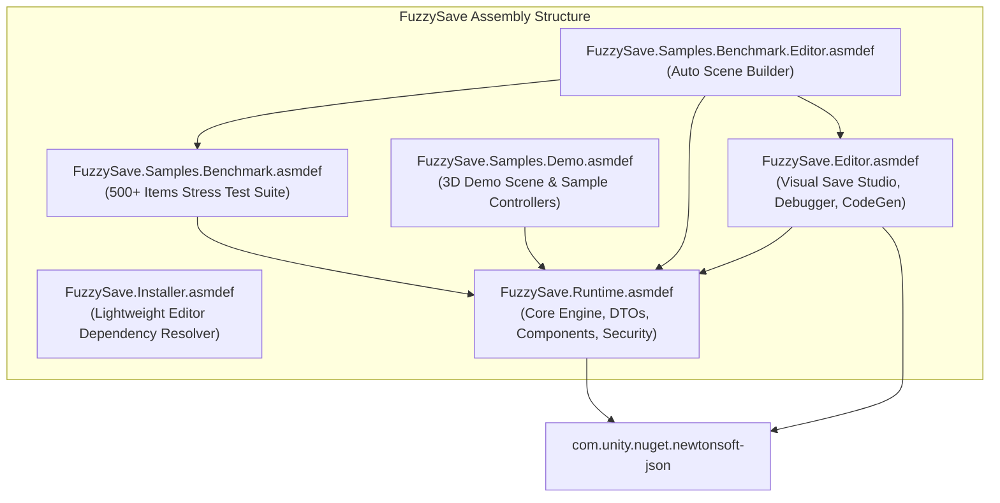

# 01. Architecture & Core Philosophy

## 🌟 Introduction

In modern game development, persistence systems are frequently implemented as an afterthought—often relying on Unity's built-in `PlayerPrefs`, simplistic JSON string serialization, or bulky third-party tools that execute all I/O operations directly on the Unity main thread.

**FuzzySave** was created to eliminate these architectural shortcomings through five core design pillars:
1. **Zero-Hitch Performance:** Offload 99% of serialization, compression, encryption, and disk I/O onto background worker threads (`Task.Run`).
2. **Fail-Safe Data Integrity:** Never corrupt player save data, even if power is abruptly severed or the game crashes mid-write.
3. **Zero-Reflection Code Generation:** Generate direct C# getter/setter bakes from visual editor mappings to avoid costly reflection overhead at runtime.
4. **Dual Workflow (Visual & Code-First):** Give technical designers the ability to bind saves with zero code via UI Toolkit windows and Trigger Zones, while empowering programmers with clean async/await C# APIs and attributes.
5. **Cross-Platform & Cloud Ready:** Native abstraction for local storage alongside industry-standard cloud providers (Unity Gaming Services, Steam Cloud, Microsoft PlayFab, Firebase, and Custom REST APIs).

---

## 📦 Package & Assembly Definition (`.asmdef`) Structure

To ensure lightning-fast compilation times, minimal assembly bloat, and strict dependency boundaries, FuzzySave is separated into modular assembly definitions:

### Assembly Breakdown:
- **`FuzzySave.Runtime.asmdef`**: Houses the entire runtime foundation: `FuzzySaveManager`, `SaveContainer`, `SaveEntry`, DTO structs, encryption (`AES-256`), compression (`GZip`), no-code components (`AutoSaveManager`, `SaveTriggerZone`), and tracking registries. It only depends on Unity's official `com.unity.nuget.newtonsoft-json`.
- **`FuzzySave.Editor.asmdef`**: Contains all editor-only tools, including `VisualSaveStudioWindow` (UI Toolkit), `PlayModeLiveDebuggerWindow`, `PartialClassEmitter` (code generation), `CodeRewriter`, custom inspectors, and asset scanners.
- **`FuzzySave.Installer.asmdef`**: Completely isolated editor bootstrap assembly responsible for detecting package dependencies at editor launch without throwing compilation errors if dependencies are missing.
- **`FuzzySave.Samples.Demo.asmdef`**: Contains the interactive 3D demo gameplay scripts, UI manager, and sample types.
- **`FuzzySave.Samples.Benchmark.asmdef` & Editor**: Houses the high-throughput stress testing arena, physics spawner, and golden baseline verification audit tools.

---

## 🛠️ Automated Dependency Installer

FuzzySave depends on the official high-performance `com.unity.nuget.newtonsoft-json` package. To eliminate manual Package Manager configuration, FuzzySave includes a self-healing dependency installer.

> [!TIP]
> **IMAGE PLACEHOLDER: DEPENDENCY INSTALLER WINDOW**
> 
> *Recommended Resolution: 800x500 | Format: PNG*
> *Caption: FuzzySave Setup Window automatically prompting the user when Newtonsoft.Json is missing.*

### How It Works:
1. **Background Inspection (`[InitializeOnLoad]`):**
   When the Unity Editor launches or assets are imported, `FuzzySaveDependencyInstaller` scans `manifest.json` and Unity's `PackageCache`.
2. **Non-Intrusive Utility Dialog:**
   If `com.unity.nuget.newtonsoft-json` is absent, a dedicated modal utility window (`FuzzySaveSetupWindow`) opens automatically.
3. **One-Click Automated Resolution:**
   Clicking **"Install Newtonsoft Json Automatically"** calls Unity's `UnityEditor.PackageManager.Client.Add("com.unity.nuget.newtonsoft-json@3.2.1")`, displaying an animated progress bar and auto-compiling once complete.

### Manual Menu Access:
- **`Tools > FuzzySave > Setup & Dependencies...`**
- **`Tools > FuzzySave > Install Newtonsoft.Json Dependency`**

---

## ⚡ Zero-Reflection vs Traditional Reflection

Traditional Unity save tools rely heavily on `System.Reflection` at runtime: inspecting type hierarchies, looping over fields, and calling `FieldInfo.GetValue` / `SetValue`. On mobile devices and consoles (IL2CPP / AOT), reflection incurs substantial garbage collection (GC) allocation, CPU cache misses, and frame stutters.

FuzzySave offers two high-efficiency alternatives:
1. **Visual Save Studio Code Bake (`PartialClassEmitter`):**
   When you map variables in the Visual Save Studio and hit **"Bake Code"**, FuzzySave compiles direct C# getters and setters into `Assets/FuzzyLogicLabs/FuzzySave/Runtime/Generated/FuzzySaveGenerated.cs`. At runtime, data collection executes as direct property lookups at native machine-code speed.
2. **Zero-Alloc DTO Structs:**
   Unity math classes (`Vector3`, `Quaternion`, `Color`, etc.) are transformed into lightweight stack-allocated DTO structs with implicit operators (`Vector3DTO dto = transform.position;`).

---

## 🧭 Next Chapter

Proceed to [02. Asynchronous Pipeline & Zero-Hitch](02_async_pipeline.md) to understand how the 3-phase execution pipeline ensures 60/120 FPS performance during high-throughput saving.
