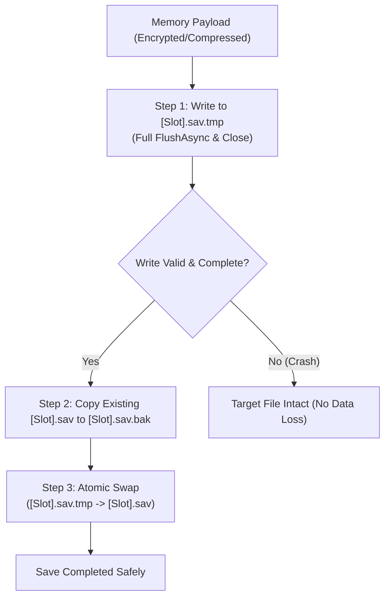

# 03. Storage, Security & Data Integrity

## 🛡️ Introduction

Player save files are vulnerable to two major risks:
1. **File Corruption (Hardware/OS Level):** If the device loses power, battery dies, or the application is forcefully terminated while `FileStream` is actively writing, the save file can be truncated to 0 bytes or left in a corrupt, unreadable state.
2. **Cheating & Tampering (User Level):** Plain JSON/XML save files stored in `Application.persistentDataPath` can easily be opened in a text editor like Notepad, allowing players to manipulate currency, health, or unlocked levels.

FuzzySave incorporates industrial-grade storage safeguards, cryptography, and compression routines to solve both problems.

---

## ⚡ Fail-Safe Atomic File I/O Pipeline

FuzzySave never writes directly to the primary save file. Instead, it utilizes a 3-step **Atomic Staged Write** protocol:



### Safety Guarantees:
- **Crash During Step 1:** The original `[Slot].sav` file remains untouched. The incomplete `.tmp` file is safely discarded on next launch.
- **Crash During Step 2 or 3:** The `.bak` backup file guarantees that full player progress can be seamlessly recovered without loss.
- **Result:** **Zero possibility of 0-byte corrupt save files.**

---

> [!TIP]
> **IMAGE PLACEHOLDER: ENCRYPTED FILE COMPARISON**
> 
> *Recommended Resolution: 1200x600 | Format: PNG*
> *Caption: Side-by-side view showing a plain text JSON file vs an AES-256 encrypted + GZip compressed FuzzySave payload opened in a hex editor.*

---

## 🔐 Cryptography & Anti-Cheat

### 1. AES-256-CBC Encryption (`EncryptionHandler`)
- **Algorithm:** Advanced Encryption Standard (AES) with a 256-bit key in Cipher Block Chaining (CBC) mode.
- **Key Derivation:** Cryptographically robust PBKDF2 key derivation using `Rfc2898DeriveBytes` (SHA-256 hash algorithm, 1000 iterations).
- **High-Performance Memory Cache:**
  PBKDF2 is computationally heavy by design to prevent brute-force attacks. To ensure this does not introduce runtime overhead during repeated saves, FuzzySave caches derived keys and initialization vectors (IVs) inside a thread-safe `ConcurrentDictionary<string, byte[]>`:

```csharp
// Excerpt from SecurityHandlers.cs
private static readonly ConcurrentDictionary<string, byte[]> s_KeyCache = 
    new ConcurrentDictionary<string, byte[]>();

public static byte[] DeriveKey(string password, byte[] salt)
{
    string cacheKey = password + Convert.ToBase64String(salt);
    return s_KeyCache.GetOrAdd(cacheKey, _ =>
    {
        using var pbkdf2 = new Rfc2898DeriveBytes(password, salt, 1000, HashAlgorithmName.SHA256);
        return pbkdf2.GetBytes(32); // 256 bits
    });
}
```

### 2. HMAC-SHA256 Tamper Proofing (`ChecksumHandler`)
- Whenever a save file is written, an HMAC-SHA256 signature is calculated over the entire encrypted payload using the developer's private security key.
- Upon loading, the checksum is computed and compared before deserialization begins.
- If a player modifies even a single byte in a hex editor, the checksum fails, preventing corrupt data or cheated values from penetrating the game's memory.

---

## 🗜️ Byte-Level GZip Compression (`CompressionHandler`)

Uncompressed JSON files in large games can easily reach **10MB to 50MB+**, consuming substantial disk space and generating high network payloads during cloud sync.

- FuzzySave utilizes `System.IO.Compression.GZipStream` with `CompressionLevel.Optimal`.
- Compression occurs on the background thread immediately after serialization and before AES encryption.
- **Size Reduction:** Typical game state JSON payloads achieve between **70% and 90% size reduction** (e.g., a 4.2 MB raw world state compresses down to ~420 KB).

---

## 📄 Serialization Formats

FuzzySave supports multiple serialization formats configured via `FuzzySaveSettings.defaultFormat`:

| Serialization Engine | File Extension | Best Used For |
|---|---|---|
| **`JsonSaveSerializer`** | `.sav` | Human-readable inspection in Save Explorer, rapid debugging, cross-engine interoperability. |
| **`BinarySaveSerializer`** | `.bin` | Maximum compactness, lowest serialization latency, consoles and memory-constrained mobile devices. |

---

## 🧩 Advanced Type & Reference Converters

Standard serializers fail when serializing Unity-specific types (such as `GameObject`, `Component`, or `ScriptableObject`) due to circular references and missing parameterless constructors. FuzzySave implements custom JSON converters:

### 1. `GameObjectReferenceConverter`
- Instead of serializing the entire scene graph, it extracts the target object's `SaveGuid` or deterministic hierarchy path (`Scene/Parent/Name#SiblingIndex`).
- Upon deserialization, it queries `GlobalGuidRegistry` or scene hierarchy to reconnect the live reference automatically.

### 2. `ScriptableObjectReferenceConverter`
- Serializes the ScriptableObject's identity (`name` and relative path).
- Deserializes by resolving instances from runtime cache or `Resources.Load<ScriptableObject>()`.

---

## 🧭 Next Chapter

Proceed to [04. Visual Save Studio](04_visual_save_studio.md) to tour the UI Toolkit editor suite, drag-and-drop mapping, and the live Save Explorer.
