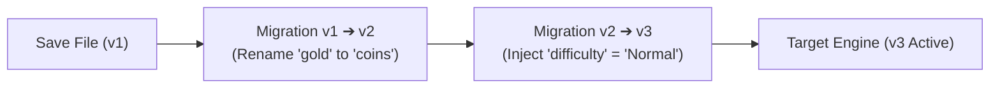

# 10. Schema Migrations & Versioning

## 🔄 Overview

As your game evolves through updates, DLCs, and patches, your data models inevitably change:
- A field is renamed (e.g., `gold` becomes `coins`).
- A new mechanic is introduced requiring default stats (e.g., `mana` or `skill_points`).
- An obsolete data structure is deprecated or refactored.

Without schema migration, loading an older save file into a patched game leads to missing data, null reference exceptions, or corrupted game states.

FuzzySave includes a dedicated **Chained Save Migration Engine** (`SaveMigrationManager`) to ensure backwards compatibility across all game versions.

---

## ⛓️ Chained Migration Architecture

Every save file records the `saveVersion` under which it was created. When `LoadAsync` is called, FuzzySave checks if the file's version matches `FuzzySaveSettings.currentSaveVersion`.

If the file is older, migrations run sequentially in a chain:



---

## 💻 Registering Migrations

Register migrations during game startup before any scenes are loaded using Unity's `[RuntimeInitializeOnLoadMethod]`:

```csharp
using UnityEngine;
using FuzzyLogicLabs.FuzzySave;

public static class GameSaveMigrations
{
    [RuntimeInitializeOnLoadMethod(RuntimeInitializeLoadType.BeforeSceneLoad)]
    public static void InitializeMigrations()
    {
        // ----------------------------------------------------
        // Step 1: Migrate Version 1 -> Version 2
        // Problem: 'gold' field renamed to 'coins'
        // ----------------------------------------------------
        SaveMigrationManager.RegisterMigration(fromVersion: 1, toVersion: 2, container =>
        {
            var goldEntry = container.entries.Find(e => e.key == "gold");
            if (goldEntry != null)
            {
                // Create new entry with migrated key
                container.entries.Add(new SaveEntry
                {
                    key = "coins",
                    typeName = goldEntry.typeName,
                    jsonValue = goldEntry.jsonValue
                });

                // Remove deprecated key
                container.entries.Remove(goldEntry);
                Debug.Log("[FuzzySave Migration] Migrated 'gold' -> 'coins' successfully.");
            }
        });

        // ----------------------------------------------------
        // Step 2: Migrate Version 2 -> Version 3
        // Problem: Added 'difficulty' setting with default "Normal"
        // ----------------------------------------------------
        SaveMigrationManager.RegisterMigration(fromVersion: 2, toVersion: 3, container =>
        {
            if (!container.entries.Exists(e => e.key == "difficulty"))
            {
                container.entries.Add(new SaveEntry
                {
                    key = "difficulty",
                    typeName = typeof(string).AssemblyQualifiedName,
                    jsonValue = "\"Normal\"" // JSON string literal
                });
                Debug.Log("[FuzzySave Migration] Injected default 'difficulty' setting.");
            }
        });
    }
}
```

---

## 🎯 Best Practices for Versioning

1. **Increment `currentSaveVersion` in `FuzzySaveSettings`:**
   Whenever you make breaking changes to saved variables, increment the version number in your settings asset.
2. **Always Keep Old Migrations in Code:**
   Never delete older migration steps (e.g., v1 -> v2). A player might return to your game after two years of updates and need to jump directly from v1 to v4!
3. **Automate via Tests:**
   Create unit tests that feed sample v1 JSON containers into `SaveMigrationManager` to verify that the migrated output matches expected modern schemas.

---

## 🧭 Next Chapter

Proceed to [11. Attributes & Code-First Development](11_attributes_code_first.md) to explore C# attribute decorators for granular code-first persistence.
