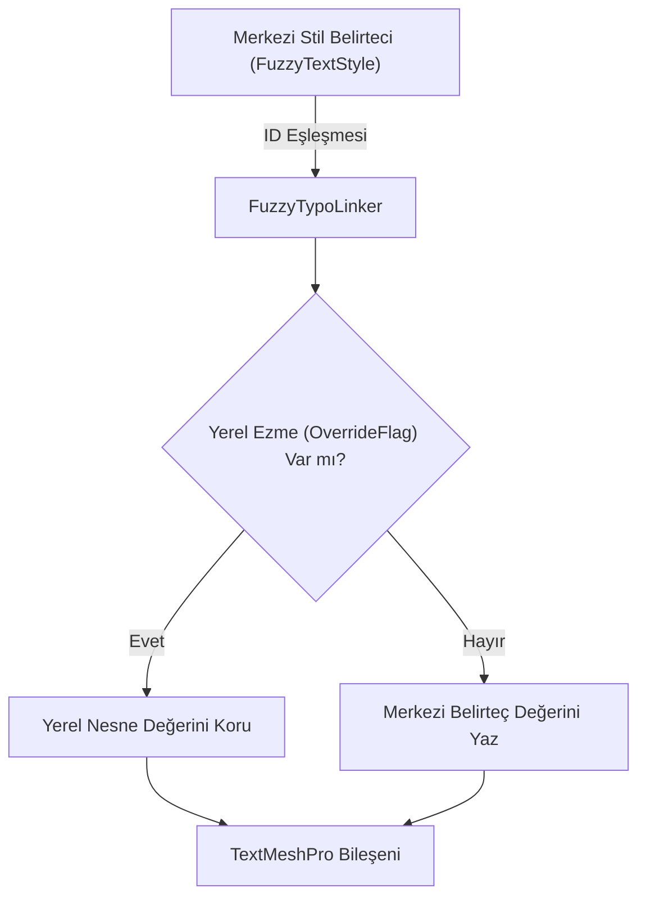

# 03. FuzzyTypoLinker Bileşeni

[← Önceki Bölüm: Temel Kavramlar ve Mimari](02-core-concepts-and-architecture.md) | [Ana Sayfa](README.md) | [Sonraki Bölüm: Master Dashboard: Tokens Studio →](04-master-dashboard-tokens-studio.md)

---

## 🌉 FuzzyTypoLinker Nedir?

`FuzzyTypoLinker`, Unity sahnelerindeki `TextMeshProUGUI` veya 3D `TextMeshPro` nesnelerine eklenen ve merkezi tasarım belirteçleri (`FuzzyTextStyle`) ile metin nesnesi arasında köprü görevi gören hafif bir `MonoBehaviour` bileşenidir.

```csharp
[ExecuteAlways]
[DisallowMultipleComponent]
[RequireComponent(typeof(TMP_Text))]
[AddComponentMenu("FuzzyTypo/Fuzzy Typo Linker")]
public class FuzzyTypoLinker : MonoBehaviour
{
    // Bileşen Gövdesi
}
```



---

## 🔍 Inspector Arayüzü (FuzzyTypoLinkerEditor)

FuzzyTypoLinker, Unity'nin modern **UI Toolkit** mimarisi kullanılarak özelleştirilmiş şık bir Inspector paneline sahiptir.


### Inspector Üzerindeki Alanlar:
1. **Bağlantı Başlığı & Durum Rozeti:** Bileşenin hangi tasarım sistemine bağlı olduğunu doğrular.
2. **Stil Seçici Açılır Menü (Style Dropdown):** Aktif temada bulunan tüm stilleri kategori hiyerarşisiyle listeler (Örn: `Headings / Heading 1`, `Buttons / Button Label`).
3. **Master Dashboard Entegrasyonu:** Tek bir tıkla Master Dashboard'u açıp seçili stili düzenleme moduna geçirir.
4. **Yerel Ezmeler (Local Overrides Bölümü):** Hangi özelliklerin stilden bağımsız korunacağını belirleyen onay kutuları.

---

## 🎛️ Yerel Ezmeler (Local Overrides & StyleOverrideFlags)

Bazen bir metin kutusunun merkezi stilin yazı tipini, boyutunu ve hizalamasını almasını istersiniz; ancak özel bir durum için renginin farklı (örneğin kırmızı bir uyarı rengi) kalmasını arzu edersiniz.

FuzzyTypo, bunu sağlamak için **Bitwise Enum Flags** (`StyleOverrideFlags`) mekanizmasını kullanır:

```csharp
[Flags]
public enum StyleOverrideFlags
{
    None             = 0,
    FontAsset        = 1 << 0,
    MaterialPreset   = 1 << 1,
    FontSize         = 1 << 2,
    AutoSizing       = 1 << 3,
    Color            = 1 << 4,
    Alignment        = 1 << 5,
    FontStyle        = 1 << 6,
    CharacterSpacing = 1 << 7,
    LineSpacing      = 1 << 8,
    WordSpacing      = 1 << 9,
    ParagraphSpacing = 1 << 10
}
```


### Nasıl Çalışır?
* Inspector'da **"Color"** bayrağını işaretlerseniz, aktif tema değiştiğinde veya stil güncellendiğinde bu metnin rengine dokunulmaz.
* Diğer tüm özellikler (Font boyutu, satır aralığı vb.) merkezi stilden beslenmeye devam eder.

---

## ⚡ Yaşam Döngüsü ve Canlı Senkronizasyon (Live Sync)

`FuzzyTypoLinker`, `[ExecuteAlways]` özniteliğine sahiptir. Bu sayede:
1. **Editör Modunda (Live Sync):** Sahne açıkken Dashboard'dan bir stilin font boyutunu veya rengini değiştirdiğinizde, sahnedeki bağlı tüm metinler anında güncellenir.
2. **Oyun Modunda (Play Mode):** `OnEnable` anında `FuzzyTypoManager` olaylarına abone olur ve en güncel stili uygular.
3. **Sıfır Bellek Sızıntısı:** `OnDisable` anında tüm olay aboneliklerini güvenle sonlandırır (`-=`).

---

## 🛡️ Prefab Güvenliği ve Geri Alma (Undo/Redo)

Editörde yapılan tüm değişiklikler Unity'nin `Undo` ve `PrefabUtility` sistemleriyle tam uyumludur:

* Bir stili değiştirdiğinizde `Ctrl+Z` (macOS: `Cmd+Z`) yaparak değişikliği anında geri alabilirsiniz.
* Prefab Variant'ları üzerinde yapılan stil atamaları ve yerel ezmeler, sahne kaydedilip yeniden açıldığında asla kaybolmaz.

---

## 💻 Scripting API (C# ile Linker Kontrolü)

Kod içerisinden `FuzzyTypoLinker` bileşenine erişmek ve müdahale etmek son derece kolaydır:

```csharp
using UnityEngine;
using TMPro;
using FuzzyLogicLabs.FuzzyTypo;

public class UIStyleModifier : MonoBehaviour
{
    [SerializeField] private FuzzyTypoLinker m_Linker;

    private void Start()
    {
        if (m_Linker == null)
            m_Linker = GetComponent<FuzzyTypoLinker>();

        // 1. Stili dinamik olarak değiştirme
        // (ID doğrudan verilebilir veya temadan sorgulanabilir)
        FuzzyTextStyle buttonStyle = FuzzyTypoManager.ActiveTheme.GetStyleByName("Button Label");
        if (buttonStyle != null)
        {
            m_Linker.StyleId = buttonStyle.Id;
        }

        // 2. Belirli bir özelliği yerel olarak ezme (Override)
        m_Linker.SetOverride(StyleOverrideFlags.Color, true);
        m_Linker.TextComponent.color = Color.red;

        // 3. Stili manuel olarak tekrar uygulama
        m_Linker.ApplyStyle();
    }
}
```

---

[← Önceki Bölüm: Temel Kavramlar ve Mimari](02-core-concepts-and-architecture.md) | [Ana Sayfa](README.md) | [Sonraki Bölüm: Master Dashboard: Tokens Studio →](04-master-dashboard-tokens-studio.md)
