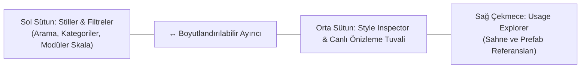

# 04. Master Dashboard: Tokens Studio

[← Önceki Bölüm: FuzzyTypoLinker Bileşeni](03-fuzzytypo-linker.md) | [Ana Sayfa](README.md) | [Sonraki Bölüm: Master Dashboard: Scene Governance →](05-master-dashboard-scene-governance.md)

---

## 🎛️ Master Dashboard Genel Bakış

**Master Dashboard (FuzzyTypo Studio)**, projenizdeki tüm tipografik stilleri, temaları, sahne bağlarını ve analitik raporları tek bir merkezden yönetmenizi sağlayan UI Toolkit tabanlı gelişmiş bir kontrol merkezidir.

Pencereye erişmek için:  
**Window > Fuzzy Logic Labs > FuzzyTypo > Master Dashboard**

### Üst Araç Çubuğu (Top Toolbar):
* **Sağlık Skoru Hapı (Health Score Badge):** Sahnenin tipografik uyumluluk skorunu gösterir (Örn: `Health: 100%`). Tıklandığında doğrudan Health & Auto-Fix sekmesini açar.
* **Tema Seçici (Theme Dropdown):** Projedeki kayıtlı temalar arasında anında geçiş yapar.
* **+ Yeni Tema Butonu:** Tek tıkla yeni bir `FuzzyTheme` ScriptableObject varlığı oluşturur.
* **••• Tema Menüsü:** Temayı Çoğaltma (Duplicate), Silme (Delete) ve JSON olarak dışa/içe aktarma (Export/Import) işlemlerini sunar.
* **Dil Seçici (Locale Dropdown):** Farklı dillerin (Örn: `ja`, `tr`, `en`) metinler üzerindeki font ve boyut etkisini editörde canlı simüle eder.
* **↻ Yenileme Butonu:** Tüm stilleri ve sahne bağlantılarını yeniden senkronize eder.

---

## 🎨 Sekme 1: Tokens Studio (Tasarım Belirteçleri Stüdyosu)

Tokens Studio, esnek ve yeniden boyutlandırılabilir 3 sütunlu adaptif bir yerleşime sahiptir:

---

## 1. Sol Sütun: Stiller ve Filtreler

* **Arama Çubuğu (Search Field):** Stil adına veya kategorisine göre anlık filtreleme yapar.
* **Dinamik Kategori Çipleri (Category Chips):** Temanızdaki stillere göre otomatik üretilen filtre etiketleridir (`All`, `Headings`, `Body`, `Buttons`, `Display`, `Badges`).
* **+ Add Butonu:** Seçili kategoriye yeni bir `FuzzyTextStyle` kartı ekler.
* **↔ Boyutlandırılabilir Ayırıcı (Resizable Splitter):** Sol sütun genişliğini farenizle sürükleyerek ayarlayabilirsiniz. Çift tıklamak genişliği varsayılan değere (`270px`) sıfırlar.

---

## ⚡ 2. Modüler Tipografi Skalası (Modular Type Scale Generator)

Görsel hiyerarşide font boyutlarının rastgele seçilmesi yerine müzikal veya mimari oranlara dayanması tipografide altın kuraldır.

Sol sütundaki **⚡ Scale** butonuna bastığınızda modüler skala sihirbazı açılır:

### Desteklenen Skala Oranları (`TypeScaleRatio`):

| Oran Adı | Çarpan | Tipik Kullanım Alanı |
| :--- | :--- | :--- |
| **Minor Second** | `1.067` | Çok yoğun mobil veri tabloları ve kompakt paneller. |
| **Major Second** | `1.125` | Küçük ekranlar, mobil RPG envanter metinleri. |
| **Minor Third** | `1.200` | Standart mobil ve tablet arayüzleri. |
| **Major Third** | `1.250` | **(Önerilen)** Masaüstü ve konsol oyun UI dengesi. |
| **Perfect Fourth** | `1.333` | Belirgin ve güçlü başlık ayrımları. |
| **Augmented Fourth** | `1.414` | Çarpıcı ve modern başlık stilleri. |
| **Perfect Fifth** | `1.500` | Sinematik ve büyük ekran başlıkları. |
| **Golden Ratio** | `1.618` | Klasik altın oran, dramatik başlık-gövde kontrastı. |

> [!TIP]
> Bir baz boyut (Örn: `16px`) ve skala oranı seçtiğinizde, sistem saniyeler içinde **Display, Heading 1-4, Body Large/Regular/Small, Button Label ve Caption** belirteçlerini kusursuz matematiksel oranlarla üretir.

---

## 3. Orta Sütun: Style Inspector & Canlı Önizleme Tuvali

### Canlı Tipografik Önizleme Tuvali (Preview Canvas):
* **Canlı Render:** Seçili stilin font, boyut, renk, aralık ve hizalama ayarlarını anında önizleme kutusunda çizer.
* **◐ Tema Arka Planı Geçişi:** Açık ve koyu arka planlar üzerinde kontrastı test etmenizi sağlar.
* **Özel Metin Girişi:** Kendi oyun metninizi yazarak karakter görünümünü test edebilirsiniz.
* **▲ Katlama Düğmesi:** İhtiyaç duyulduğunda tuvali daraltarak form alanına daha fazla yer açabilirsiniz.

### Stil Parametreleri Formu:
1. **Kimlik & Tanım:** Stil adı, kategori ve tasarımcı notları.
2. **Font & Materyal:** `TMP_FontAsset` ve `Material Preset` seçimi.
3. **Boyutlandırma:** Standart font boyutu veya `Enable Auto-Sizing` (Min / Max font boyutu).
4. **Renk & Font Stili:** Renk seçici, Kalın (Bold), İtalik (Italic), Altı Çizili, BÜYÜK HARF vb.
5. **Hizalama & Aralıklar:** Karakter aralığı (Character Spacing), Satır aralığı (Line Spacing), Paragraf aralığı ve Kelime aralığı.
6. **Yerelleştirme Ezmeleri:** Dile özel font ve boyut kuralları (Bkz. [Bölüm 09](09-localization-and-multilingual.md)).

---

## 👁️ 4. Sağ Çekmece: Usage Explorer (Kullanım Gezgini)

Orta sütunun sağ üstündeki **👁 Usages** butonuna tıklandığında sağ taraftan animasyonlu bir referans çekmecesi açılır.

### Usage Explorer Özellikleri:
* **Tam Kapsamlı Tarama:** Seçili stilin aktif sahnede ve proje genelindeki tüm prefab varlıklarında kaç kez kullanıldığını listeler.
* **Tek Tıkla Odaklanma (`PingObject`):** Listedeki herhangi bir nesneye tıkladığınızda Unity hiyerarşisinde veya proje klasöründe doğrudan ilgili nesne vurgulanır ve seçilir.
* **Bağlantı Sayacı:** Projede artık kullanılmayan (0 referanslı) atıl stilleri tespit etmenize yardımcı olur.

---

[← Önceki Bölüm: FuzzyTypoLinker Bileşeni](03-fuzzytypo-linker.md) | [Ana Sayfa](README.md) | [Sonraki Bölüm: Master Dashboard: Scene Governance →](05-master-dashboard-scene-governance.md)
