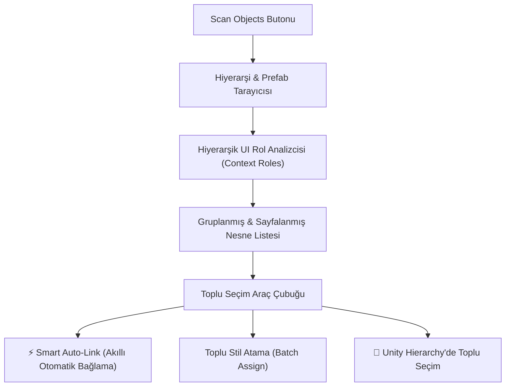

# 05. Master Dashboard: Scene Governance

[← Önceki Bölüm: Master Dashboard: Tokens Studio](04-master-dashboard-tokens-studio.md) | [Ana Sayfa](README.md) | [Sonraki Bölüm: Master Dashboard: Health & Auto-Fix →](06-health-and-autofix-studio.md)

---

## 🏛️ Sekme 2: Scene & Prefab Governance Manager

Master Dashboard'un ikinci sekmesi olan **Scene Governance**, açık olan sahnedeki veya projedeki prefab varlıklarında bulunan tüm `TMP_Text` bileşenlerini tarar, gruplandırır ve **toplu yönetim (bulk governance)** yetenekleri sunar.

---

## 🔍 Tarama Kapsamı ve Filtreleme Kontrolleri

Üst denetim panelinde taramanın derinliği ve filtreleri belirlenir:

* **Tarama Kapsamı (Scope):**
  * `Active Scene`: Yalnızca açık olan aktif sahnedeki nesneleri tarar.
  * `Selected Hierarchy`: Hiyerarşide seçtiğiniz ana nesnenin (Parent UI Canvas) altındaki çocukları tarar.
  * `Project Prefabs`: Projedeki tüm UI prefab dosyalarını tarar.
* **Dinamik Çip Filtreleri (Facet Filter Chips):**  
  Tek tıkla `All`, `Unlinked` (Bağlantısız), `Linked` (Bağlı), `Buttons`, `Inputs` gibi hazır segmentlere odaklanmanızı sağlar.
* **Arama Çubuğu:** Nesne adına, metin içeriğine (text snippet) veya font ismine göre anlık arama yapar.

---

## 🧩 Akıllı UI Rol Tespiti (Context Roles)

FuzzyTypo, sıradan bir metin tarayıcısından farklı olarak `FuzzyHierarchyContextUtility` motorunu kullanır.

Metin nesnesinin üst ebeveyn hiyerarşisini (4 seviyeye kadar) analiz ederek metnin ne tür bir UI bileşenine ait olduğunu otomatik olarak algılar:

| Tespit Edilen Rol | Simge & Rozet | Algılanan Üst Ebeveyn Bileşeni |
| :--- | :--- | :--- |
| **Button** | `[Button]` | `UnityEngine.UI.Button` |
| **InputField** | `[InputField]` | `TMP_InputField` veya `UnityEngine.UI.InputField` |
| **Toggle** | `[Toggle]` | `UnityEngine.UI.Toggle` |
| **Dropdown** | `[Dropdown]` | `TMP_Dropdown` veya `UnityEngine.UI.Dropdown` |
| **Slider** | `[Slider]` | `UnityEngine.UI.Slider` |
| **ScrollRect** | `[ScrollRect]` | `UnityEngine.UI.ScrollRect` |
| **Generic** | `[Generic]` | Bağımsız metin veya etiket |

---

## ⚡ Akıllı Otomatik Bağlama (Smart Auto-Link)

Scene Governance'ın en güçlü üretkenlik özelliklerinden biri **Smart Auto-Link** motorudur:

1. Sistem, sahnedeki **Unlinked (bağlantısız)** metinleri tespit eder.
2. Metnin tespit edilen UI rolüne (`Button`, `InputField` vb.) ve mevcut font boyutuna bakar.
3. Aktif temadaki en uygun `FuzzyTextStyle` token'ını otomatik olarak eşleştirir.
4. Tek tıkla nesneye `FuzzyTypoLinker` ekler ve stili atar.

> [!TIP]
> Örneğin, boyutu 16 olan ve bir `Button` ebeveyninin içinde yer alan bir metin, otomatik olarak `Buttons / Button Label` stiliyle eşleştirilir. Yüzlerce metinlik dev bir UI projesi saniyeler içinde sisteme dahil edilebilir!

---

## 🧰 Toplu İşlem Araç Çubuğu (Power Multi-Selection)

Listedeki metinlerin solundaki onay kutularını kullanarak çoklu seçim yapabilir veya hızlı seçim butonlarından yararlanabilirsiniz:

* **Hızlı Seçim Butonları:**
  * `All`: Filtrelenmiş tüm nesneleri seçer.
  * `Unlinked`: Sadece sisteme bağlı olmayanları tek tıkla seçer.
  * `None`: Seçimi temizler.
  * `Invert`: Seçimi tersine çevirir.
* **Toplu Eylemler (Batch Actions):**
  * **Assign Dropdown:** Seçili tüm nesnelere tek tıkla belirli bir stil belirtecini atar.
  * **Unlink Butonu:** Seçili nesnelerden `FuzzyTypoLinker` bileşenini güvenle kaldırır.
  * **🎯 Hierarchy Butonu:** Seçili tüm nesneleri Unity'nin yerleşik Hiyerarşi penceresinde anında toplu seçili hale getirir.

---

## 📄 Yüksek Performanslı Sayfalama (Pagination Engine)

Binlerce metin nesnesi içeren devasa RPG, MMO veya Simülasyon projelerinde tüm nesneleri tek bir listede çizmek editörde kasılmalara (lag) neden olabilir.

FuzzyTypo, **sayfalama motoru (`scene-pagination-bar`)** ile donatılmıştır:
* Sayfa Başına Gösterim: `25`, `50`, `100` veya `All` nesne.
* Sayfalar Arası Hızlı Geçiş: `◀ Prev` ve `Next ▶` butonları.
* Bellek Dostu: Sadece ekranda görünen sayfa işlenir, editör 60+ FPS hızında akıcı kalır.

---

## 🎨 Entegre Toplu Materyal Değiştirici (Material Swapper Drawer)

Toolbar'daki **🎨 Material Swapper** butonuna basıldığında açılan çekmecedir:

* Belirli bir fontu filtreleyebilir (Örn: `LiberationSans SDF`).
* Hedef Material Preset'i belirleyip (Örn: `Gold Outline Glow Material`) **Execute Swap** butonuna basarak taranan tüm metinlerin materyalini tek hamlede güncelleyebilirsiniz.

---

[← Önceki Bölüm: Master Dashboard: Tokens Studio](04-master-dashboard-tokens-studio.md) | [Ana Sayfa](README.md) | [Sonraki Bölüm: Master Dashboard: Health & Auto-Fix →](06-health-and-autofix-studio.md)
