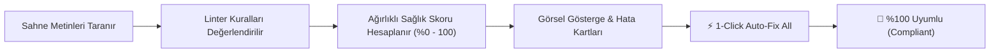

# 06. Master Dashboard: Health & Auto-Fix Studio

[← Önceki Bölüm: Master Dashboard: Scene Governance](05-master-dashboard-scene-governance.md) | [Ana Sayfa](README.md) | [Sonraki Bölüm: Master Dashboard: Insights & Analytics →](07-insights-and-analytics.md)

---

## 🩺 Sekme 3: Health & Auto-Fix Studio Nedir?

Bir oyun projesi büyüdükçe farklı geliştiricilerin ve arayüz tasarımcılarının eklediği metin nesneleri tasarım sisteminden kopmaya başlar:
* Kimi butonlar tasarımdaki fontu kullanmaz,
* Bazı metin kutularında eksik Türkçe veya Japonca karakterler (glyph) yüzünden ekranda boş kareler (`□` veya `?`) çıkar,
* Kimi metinler sisteme hiç bağlanmamıştır.

**Health & Auto-Fix Studio**, sahnelerinizi otomatik denetleyen (`FuzzyTypographyLinter`), bir **Tasarım Sistemi Sağlık Skoru (%0 - 100)** hesaplayan ve bulunan tüm uyumsuzlukları **Tek Tıkla Otomatik Onaran (1-Click Auto-Fix All)** yapay zeka destekli bir kalite güvence (QA) merkezidir.

---

## 📊 Tasarım Sistemi Sağlık Skoru (Health Score Gauge)

Pencerenin üst kısmında yer alan **Hero Health Card**, projenizin tipografik sağlık durumunu görsel bir gösterge (meter track) ile sunar:

* **%100 (Yeşil - Compliant):** Sahnedeki tüm metinler tasarım sistemine bağlıdır, fontlar eksiksizdir ve glif kaybı yoktur.
* **%70 - %99 (Sarı - Warnings):** Bazı metinler sisteme bağlı değildir veya yerel ezmeler mevcuttur.
* **%0 - %69 (Kırmızı - Errors):** Kritik eksik fontlar veya derlemede bozuk görünecek kayıp glifler bulunmaktadır.

---

## ⚠️ Denetlenen Sorun Tipleri ve Şiddet Seviyeleri

`FuzzyTypographyLinter`, metinleri 5 ana kategoride denetler:

| Sorun Tipi (`IssueType`) | Şiddet | Puan Etkisi | Açıklama |
| :--- | :--- | :--- | :--- |
| **MissingFontAsset** | `Error` | Yüksek | Metin bileşeninde font (`TMP_FontAsset`) atanmamıştır (`None`). Ekranda pembe veya bozuk görünür. |
| **MissingGlyphs** | `Error` | Yüksek | Metnin içeriğindeki karakterler (Örn: Türkçe `ç, ğ, ş`, Japonca Kanji, semboller) font atlasında ve fallback fontlarda yoktur. Ekranda `□` basılır. |
| **UnlinkedText** | `Warning` | Orta | Metin bir `FuzzyTypoLinker` bileşenine bağlı değildir; merkezi temadan etkilenmez. |
| **OffScaleFontSize** | `Warning` | Orta | Metnin font boyutu (Örn: `17.3px`), aktif temadaki hiçbir modüler skala token'ına uymamaktadır. |
| **LocalOverrides** | `Info` | Düşük | Metin merkezi stile bağlıdır ancak yerel olarak rengi veya boyutu ezilmiştir. |

---

## ⚡ 1-Click Auto-Fix All (Tek Tıkla Otomatik Onarım)

Her sorunu tek tek el ile düzeltmek saatler alabilir. Sağ üstte bulunan yeşil **"1-Click Auto-Fix All Issues"** butonu tam bu noktada devreye girer:

### 1-Click Auto-Fix Butonuna Basıldığında Ne Olur?
1. **Eksik Fontlar Onarılır:** Fontu boş olan metinlere aktif temanın ana fontu atanır.
2. **Bağlantısız Metinler Otomatik Bağlanır:** Font boyutuna ve UI rolüne göre en yakın `FuzzyTextStyle` belirlenip linker eklenir.
3. **Kayıp Glifler Çözülür (`FuzzyGlyphFixer`):** Font atlasında bulunmayan karakterler için otomatik olarak işletim sistemi fontlarından (`Yu Gothic`, `Segoe UI Symbol` vb.) **Fallback Font Asset** üretilir ve ana fonta zincirlenir.
4. **Hatalı Ezmeler Temizlenir:** İsteğe bağlı olarak geçersiz yerel ezmeler temizlenir.
5. **Sonuç:** Sahne saniyeler içinde **%100 Sağlık Skoruna** ulaşır!

> [!NOTE]
> Yapılan tüm onarımlar Unity'nin `Undo` geçmişine kaydedilir. Beğenmediğiniz bir adımı `Ctrl+Z` (macOS: `Cmd+Z`) ile geri alabilirsiniz.

---

## 🔍 Tekil Sorun Kartı Arayüzü

Listede her sorun bağımsız bir kart olarak sunulur:
* **Başlık & Hiyerarşi Yolu:** Hangi GameObject üzerinde olduğu (`Canvas > Panel > TitleText`).
* **Açıklama:** Sorunun teknik sebebi ve eksik karakterlerin Unicode kodları (Örn: `U+011F (ğ)`).
* **Ping Butonu:** Nesneye tıklayarak sahnede anında odaklanma (`EditorGUIUtility.PingObject`).
* **Önerilen Eylem Butonu:** Sorunu sadece o nesne için tekil olarak onarma (Örn: *"Link to 'Heading 1'"* veya *"Add Fallback Font"*).

---

[← Önceki Bölüm: Master Dashboard: Scene Governance](05-master-dashboard-scene-governance.md) | [Ana Sayfa](README.md) | [Sonraki Bölüm: Master Dashboard: Insights & Analytics →](07-insights-and-analytics.md)
