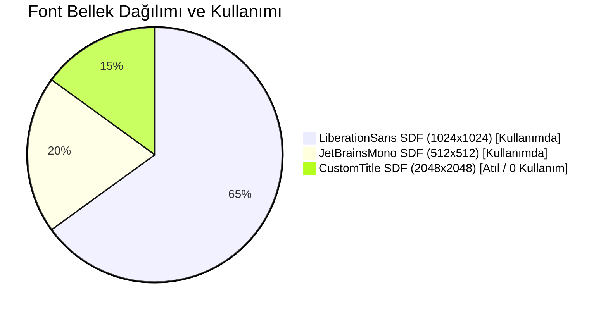
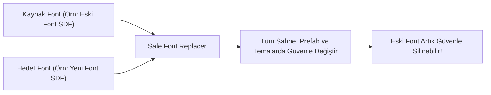

# 07. Master Dashboard: Insights & Analytics

[← Önceki Bölüm: Master Dashboard: Health & Auto-Fix](06-health-and-autofix-studio.md) | [Ana Sayfa](README.md) | [Sonraki Bölüm: Master Dashboard: Settings & Pro →](08-settings-and-pro-features.md)

---

## 📊 Sekme 4: Insights & Analytics Studio Nedir?

Büyük oyun projelerinde yazı tipleri (Font Assets) ve onların oluşturduğu atlas dokuları (SDF Texture Atlases), projenin **bellek (RAM/VRAM) ve derleme boyutunu (Build Size)** doğrudan etkileyen en ağır UI varlıklarıdır. Yanlışlıkla eklenmiş 2048x2048 boyutunda kullanılmayan iki font atlası, oyunun mobil cihazlardaki bellek sınırını aşmasına neden olabilir.

**Insights & Analytics Studio**, projenizdeki tipografi ayak izini röntgen gibi tarayan, bellek ağırlıklarını raporlayan ve prefab bazında tipografi kapsamını haritalandıran analitik motorudur.

---

## ⚖️ 1. Font Varlık Ağırlığı ve Bellek Analizi (FuzzyFontAnalytics)

Sol sütunda projenizde tespit edilen tüm `TMP_FontAsset` varlıkları taranır ve bellek kartları halinde listelenir:

### İncelenen Metrikler:
* **Atlas Boyutları ve Bellek (VRAM):** Örneğin `1024x1024 (1.0 MB)` veya `2048x2048 (4.0 MB)`.
* **Sahne ve Prefab Referans Sayısı:** Bu font aktif sahnede kaç metin kutusunda, kaç prefabda ve kaç tema stilinde kullanılıyor?
* **Atıl Font Tespiti (Unused Badge):** Projede yer alan fakat ne sahnede, ne prefabda, ne de temalarda referans verilmeyen fontları `[Unused]` rozetiyle işaretler. Bu sayede gereksiz fontları silerek derleme boyutundan anında megabaytlarca tasarruf edebilirsiniz.
* **Nadir Kullanım (Rarely Used):** Sadece 1 veya 2 yerde kullanılan gereksiz özel fontları tespit eder.

---

## 🧩 2. Prefab Tipografi Matrisi (FuzzyPrefabAnalytics)

Sağ sütunda, projenizdeki tüm UI prefab varlıklarının tipografik kapsama oranı (`Coverage %`) listelenir:

### Matris Bilgileri:
* **Kapsama Rozeti (`Coverage Badge`):** Örneğin `8/10 (80%)`. Prefabın içindeki 10 metinden 8'inin sisteme bağlı olduğunu gösterir.
* **Aktif Sahne Örnek Sayısı:** Bu prefabdan sahnede kaç adet klon (instance) olduğunu belirtir (`In Scene: 5`).
* **Kullanılan Fontlar:** Prefabın ihtiyaç duyduğu font varlıklarının listesi.
* **Tek Tıkla Prefab Açma:** Listedeki prefab adına tıklayarak Unity Proje penceresinde veya Prefab Editör modunda açabilirsiniz.

---

## 🔄 3. Güvenli Font Değiştirici (Safe Font Replacer)

Unity'de bir font dosyasını sildiğinizde veya değiştirdiğinizde, o fontu kullanan yüzlerce prefabda metin kutuları `None (TMP_FontAsset)` durumuna düşer ve bozulur.

Toolbar'daki **🔄 Safe Font Replacer** butonuna tıklandığında açılan çekmece bu riski sıfıra indirir:

### Nasıl Kullanılır?
1. **Source Font:** Değiştirmek istediğiniz eski fontu seçin.
2. **Target Font:** Yerine geçecek yeni fontu seçin.
3. **Execute Replace:** Butona bastığınızda sistem tüm sahneleri, tüm prefabları ve tüm `FuzzyTheme` varlıklarını tarar, eski fontu yenisiyle güvenle takas eder.
4. Artık eski fontu projenizden hiçbir hata almadan silebilirsiniz!

---

## 📈 4. UI Hiyerarşik Rol Dağılımı (Role Distribution)

Pencerenin alt bölümünde, projenizdeki tipografinin hangi UI elementlerinde yoğunlaştığını gösteren yatay bir dağılım çubuğu yer alır:

* Butonlar (`Button`), Giriş Kutuları (`InputField`), Başlıklar ve Genel Metinlerin oransal dağılımını göstererek arayüz dengesini gözlemlemenizi sağlar.

---

[← Önceki Bölüm: Master Dashboard: Health & Auto-Fix](06-health-and-autofix-studio.md) | [Ana Sayfa](README.md) | [Sonraki Bölüm: Master Dashboard: Settings & Pro →](08-settings-and-pro-features.md)
