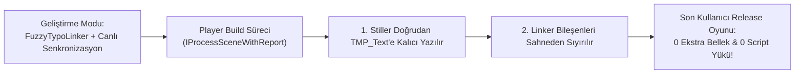

# 08. Master Dashboard: Settings & Pro

[← Önceki Bölüm: Master Dashboard: Insights & Analytics](07-insights-and-analytics.md) | [Ana Sayfa](README.md) | [Sonraki Bölüm: Çok Dilli Tipografi & Yerelleştirme →](09-localization-and-multilingual.md)

---

## ⚙️ Sekme 5: System Settings & Pro Engine

Master Dashboard'un son sekmesi olan **Settings & Pro**, projenin küresel yapılandırma parametrelerini yönettiğiniz, endüstri standardı **JSON Design Tokens (Figma/W3C DTCG)** veri alışverişini gerçekleştirdiğiniz ve üretim sürümleri için **Sıfır Ek Yük (Bake & Strip)** optimizasyonunu yapılandırdığınız alandır.


---

## ⚡ 1. Build Optimizasyonu: Bake & Strip (Pro Engine)

Konsol, mobil veya AAA ölçekli projelerde gereksiz her script ve her bellek referansı optimize edilmelidir.

**Bake & Strip Mantığı:**
* Geliştirme (Editor) esnasında `FuzzyTypoLinker` bileşenleri canlı senkronizasyon ve tasarım esnekliği sağlar.
* Ancak oyun son kullanıcı için derlenirken (Release Build), metinlerin özellikleri doğrudan `TMP_Text` üzerine kalıcı olarak yazılır (**Bake**) ve `FuzzyTypoLinker` bileşenleri sahneden tamamen silinir (**Strip**).
* **Sonuç:** Oyunda sıfır ek bellek ve sıfır script yükü!




### Yapılandırma Seçenekleri:
* **Auto-Strip on Player Builds:** Açık olduğunda `FuzzyBakeAndStripProcessor` derleme sürecinde otomatik olarak çalışır.
* **Bake & Strip Active Scene Now:** Editör modundayken aktif sahnede bu işlemi manuel olarak tetiklemenizi sağlar (Geri alma `Ctrl+Z` desteklidir).

---

## 🌐 2. Tasarım Belirteçleri Birlikte Çalışabilirlik (Figma / W3C JSON)

Figma, Penpot veya harici web tasarım sistemleri kullanan tasarımcılarla iletişim kurmanın en modern yolu **W3C Design Tokens Community Group (DTCG)** formatıdır.


### Yetenekler:
* **Export JSON (`btn-export-tokens-json`):** Aktif temanızdaki tüm stilleri, renkleri, font boyutlarını ve aralıklarını temiz bir JSON dosyası olarak dışa aktarır.
* **Import JSON (`btn-import-tokens-json`):** Figma veya Style Dictionary gibi araçlardan gelen JSON dosyasını içeri aktarır. Projedeki fontları otomatik tarar ve stilleri temaya enjekte eder.

#### Örnek Token JSON Formatı:
```json
{
  "themeName": "Dark Theme",
  "formatVersion": "1.0",
  "tokens": [
    {
      "id": "c7e48b9a-12d4-4f90-a3bc-91e847c2a110",
      "name": "H1 / Hero Display",
      "category": "Headings",
      "fontAssetName": "LiberationSans SDF",
      "fontSize": 38.0,
      "colorHex": "#FFFFFFFF",
      "fontStyle": "Bold",
      "alignment": "TopLeft",
      "characterSpacing": 0.0,
      "lineSpacing": 0.0
    }
  ]
}
```

---

## 🛠️ 3. Hızlı Kurulum & Başlangıç Varlıkları (Quick Setup)


* **Generate Starter Themes:** Saniyeler içinde projenize tam donanımlı `SampleDarkTheme` ve `SampleLightTheme` varlıklarını kurar.
* **Build Demo Scene:** 75'ten fazla gerçekçi UI öğesini (Combat HUD, Envanter, Çok Dilli Görevler ve Ayarlar) barındıran interaktif Demo Sahnesini üretir.
* **Project Settings:** Unity'nin ana `Edit > Project Settings > FuzzyTypo` sekmesine doğrudan kısayol sağlar.

---

## 🌍 4. Akıllı Yerelleştirme Profilleri (Smart Localization Profiles)

Kartların altında yer alan geniş panel, projenizin global dil ölçekleme ve font değiştirme kurallarını yönetir:


* **+ Add Language Rule:** Yeni bir dil (Örn: `ja` - Japonca veya `ar` - Arapça) kuralı eklemenizi sağlar.
* Her dil için varsayılan Fallback Font, Material Preset, Font Boyutu Çarpanı (`FontSizeMultiplier`) ve Satır Boşluğu Ofseti (`LineSpacingOffset`) tanımlanabilir.
* Detaylı kullanım için bir sonraki bölümü inceleyin.

---

[← Önceki Bölüm: Master Dashboard: Insights & Analytics](07-insights-and-analytics.md) | [Ana Sayfa](README.md) | [Sonraki Bölüm: Çok Dilli Tipografi & Yerelleştirme →](09-localization-and-multilingual.md)
