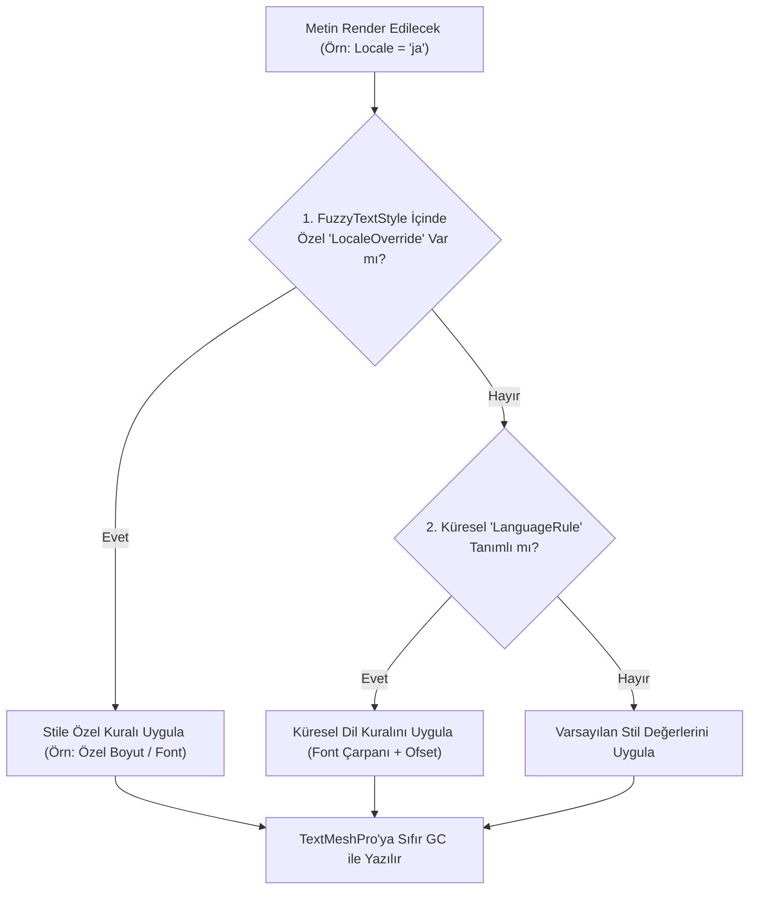

# 09. Çok Dilli Tipografi & Yerelleştirme

[← Önceki Bölüm: Master Dashboard: Settings & Pro](08-settings-and-pro-features.md) | [Ana Sayfa](README.md) | [Sonraki Bölüm: Bağımsız Editör Araçları →](10-standalone-tools.md)

---

## 🌍 Oyunlarda Çok Dilli Tipografi Zorlukları

Oyununuzu küresel pazara açtığınızda tipografi ciddi bir mühendislik problemine dönüşür:
* **CJK Dilleri (Japonca, Çince, Korece):** Latin alfabesi fontlarında CJK glifleri bulunmaz. Ekranda boş kutular (`□`) veya soru işaretleri çıkar. Ayrıca CJK karakterleri Latin harflerine göre daha dikey ve karmaşık olduğundan font boyutunun `%85-90` oranında küçültülmesi ve satır aralığının artırılması gerekir.
* **Almanca:** Uzun birleşik kelimeler yüzünden metin kutuları taşar.
* **Arapça:** Sağdan sola (RTL) okuma ve özel glif harmanlama gerektirir.
* **Türkçe:** `İ / i` ve `I / ı`, `ş, ğ, ç` gibi diyakritik harfler çoğu standart font atlasında eksiktir.

**FuzzyTypo**, iki kademeli (Two-Tier) akıllı yerelleştirme mimarisiyle bu sorunları kökten çözer.

---

## 🏛️ İki Kademeli Çözüm Stratejisi



---

## 1. Kademe: Küresel Dil Kuralları (FuzzyLocalizationProfile)

`FuzzyLocalizationProfile` bir `ScriptableObject` varlığıdır ve projenin tamamında geçerli olan global dil kurallarını (`LanguageRule`) barındırır:


```csharp
[Serializable]
public class LanguageRule
{
    public string LocaleCode;              // Örn: "ja", "tr", "de", "ar"
    public string DisplayName;             // Örn: "Japanese"
    public TMP_FontAsset DefaultFontAsset; // Bu dil seçildiğinde devreye girecek font
    public Material DefaultMaterialPreset;
    public float FontSizeMultiplier;       // Örn: 0.90f (Metinleri %10 küçült)
    public float LineSpacingOffset;        // Örn: +4f (Satır aralığını aç)
    public float CharacterSpacingOffset;
}
```

* Örneğin `ja` dili için `FontSizeMultiplier = 0.9` ve `LineSpacingOffset = 3` tanımlandığında, oyuncu oyunu Japonca yaptığında sahnedeki yüzlerce metin otomatik olarak küçülür ve satır taşmaları önlenir.

---

## 2. Kademe: Stile Özel Ezmeler (LocaleOverride)

Eğer belirli bir başlık stilinin (`H1 Hero`) Japonca için bambaşka bir özel font veya farklı bir boyut kullanmasını isterseniz, ilgili stil kartının içine doğrudan **LocaleOverride** ekleyebilirsiniz:


* **Override Font Asset:** O dile özel farklı bir font atayın.
* **Use Font Size Multiplier:** Dilerseniz yüzde çarpanı (Örn: `0.85x`), dilerseniz doğrudan sabit bir piksel boyutu (Örn: `32px`) belirleyin.
* **Spacing & Alignment Overrides:** Hizalama ve satır boşluklarını dile özel yapılandırın.

---

## 🤖 Otomatik Fallback & CJK Glif Çözücü (FuzzyGlyphFixer)

FuzzyTypo'nun en çarpıcı yeniliklerinden biri yerleşik **`FuzzyGlyphFixer`** motorudur.

Linter denetimi sırasında sahnede font atlasında bulunmayan karakterler (Örn: Japonca `あ, い, う` veya semboller `★, ⚔, 🛡`) tespit edildiğinde:
1. Geliştiricinin elle font üretmesine gerek kalmaz.
2. `FuzzyGlyphFixer`, işletim sistemindeki sistem fontlarını (Windows'ta `Yu Gothic UI`, `Segoe UI Symbol`; macOS'ta `Hiragino Sans`, `Apple Symbols`) otomatik tarar.
3. Arka planda `Assets/FuzzyLogicLabs/FuzzyTypo/Editor/Fonts/` dizini altında otomatik olarak:
   * `FuzzyCJK SDF.asset`
   * `FuzzySymbols SDF.asset`
   * `FuzzyFallback SDF.asset`  
   font varlıklarını derler.
4. Bu üretilen fontları projenin ana fontunun **Fallback Font Listesine (`fallbackFontAssetTable`)** otomatik olarak zincirler!
5. Oyunda ekranda hiçbir zaman boş kutucuk (`□`) görünmez!

---

## 💻 Çalışma Zamanında Dil Değiştirme (API Kullanımı)

Oyun içi ayarlar menünüzden dili değiştirmek için `FuzzyLocalizationManager` veya `FuzzyTypoManager` sınıflarını kullanabilirsiniz:

```csharp
using UnityEngine;
using FuzzyLogicLabs.FuzzyTypo;

public class LanguageSelector : MonoBehaviour
{
    // 1. ISO Dil Kodu ile Değiştirme
    public void SelectJapanese()
    {
        FuzzyLocalizationManager.SetLocale("ja");
    }

    public void SelectTurkish()
    {
        FuzzyLocalizationManager.SetLocale("tr");
    }

    // 2. Unity SystemLanguage Enum ile Değiştirme
    public void SelectGerman()
    {
        FuzzyLocalizationManager.SetLanguage(SystemLanguage.German);
    }

    // 3. Cihazın / İşletim Sisteminin Diline Otomatik Eşitleme
    public void AutoDetectDeviceLanguage()
    {
        FuzzyLocalizationManager.SyncWithSystemLanguage();
    }
}
```

> [!NOTE]
> Dil değişimi tetiklendiğinde `FuzzyTypoManager.OnLocaleChanged` olayı tetiklenir ve sahnedeki tüm aktif `FuzzyTypoLinker` bileşenleri **sıfır bellek tahsisi (0 byte GC Alloc)** ile yeni dil fontlarını ve boyutlarını uygular.

---

[← Önceki Bölüm: Master Dashboard: Settings & Pro](08-settings-and-pro-features.md) | [Ana Sayfa](README.md) | [Sonraki Bölüm: Bağımsız Editör Araçları →](10-standalone-tools.md)
