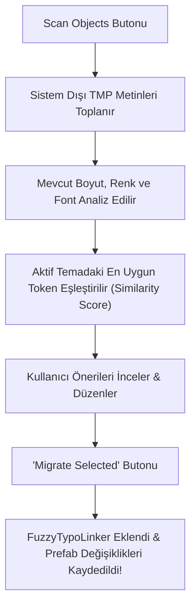

# 10. Bağımsız Editör Araçları

[← Önceki Bölüm: Çok Dilli Tipografi & Yerelleştirme](09-localization-and-multilingual.md) | [Ana Sayfa](README.md) | [Sonraki Bölüm: Çalışma Zamanı API & Scripting →](11-runtime-api-and-scripting.md)

---

## 🛠️ Editör Yardımcı Araçları Genel Bakış

Master Dashboard'un yanı sıra FuzzyTypo, büyük projelerde sıkça karşılaşılan operasyonel ihtiyaçları çözmek üzere tasarlanmış üç bağımsız uzman editör aracına sahiptir:

| Araç Adı | Sınıf | Temel Görevi |
| :--- | :--- | :--- |
| **Auto-Migrator** | `FuzzyAutoMigrator` | Eski projelerdeki yüzlerce bağımsız TMP nesnesini akıllı benzerlik analiziyle sisteme dahil eder. |
| **Glyph Analyzer** | `FuzzyGlyphAnalyzer` | Font atlaslarını Türkçe, Almanca, Fransızca veya özel alfabelere karşı denetleyerek eksik glifleri raporlar. |
| **Batch Material Swapper** | `FuzzyMaterialSwapper` | Sahne ve prefab hiyerarşisinde aynı fontu kullanan nesnelerin materyallerini toplu olarak değiştirir. |

---

## 1. FuzzyTypo Auto-Migrator (Eski Projeleri Taşıma Aracı)

Mevcut bir projeyi FuzzyTypo'ya geçirirken yüzlerce sahne ve prefab metnine tek tek linker bileşeni eklemek günler alabilir. **Auto-Migrator**, bu süreci birkaç saniyeye indirir.

### Yetenekleri:
* **Tarama Kapsamı (Scan Scope):** `ActiveScene`, `SelectedHierarchy` veya tüm `ProjectPrefabs`.
* **Akıllı Benzerlik Algoritması:** Metnin font boyutuna ve rengine en yakın `FuzzyTextStyle` token'ını önerir (Örn: Boyutu `25.5` olan bir başlığı `Heading 2` [26px] ile eşleştirir).
* **Toplu Onay ve Taşıma:** `Select All` ve `Migrate Selected` butonları ile tek tıkla `FuzzyTypoLinker` bileşenlerini ekler.

---

## 2. FuzzyTypo Glyph Analyzer (Font Glif Denetleyicisi)

Oyununuzu yeni bir dilde yayınlamadan önce, font atlasınızın o dilin tüm karakterlerini içerdiğinden emin olmanız gerekir.

### Desteklenen Hazır Alfabe Kümeleri:
* **Turkish (Türkçe):** `ç, ğ, ı, ö, ş, ü, Ç, Ğ, İ, Ö, Ş, Ü`
* **German (Almanca):** `ä, ö, ü, ß, Ä, Ö, Ü`
* **French (Fransızca):** `à, â, æ, ç, é, è, ê, ë, î, ï, ô, œ, ù, û, ü, ÿ...`
* **Spanish (İspanyolca):** `á, é, í, ó, ú, ü, ñ, ¿, ¡...`
* **Polish (Lehçe):** `ą, ć, ę, ł, ń, ó, ś, ź, ż...`
* **Japanese Hiragana (Japonca):** `あ, い, う, え, お...`
* **Custom (Özel Metin):** Kendi yazdığınız metin öbeğindeki karakterlerin fontta olup olmadığını test edebilirsiniz.

### Raporlama Özellikleri:
* **Fallback Kontrolü:** İsteğe bağlı olarak `Include Fallback Fonts in Check` işaretlenerek yedek font zincirindeki karakterler de hesaba katılabilir.
* **Analyze Theme Fonts:** Aktif temada kullanılan tüm fontları tek tıkla toplu olarak denetler.
* **Eksik Glif Listesi:** Bulunamayan karakterlerin hem harf hem de Unicode (Örn: `U+015E`) karşılıklarını listeler.

---

## 3. Batch Material Swapper (Toplu Materyal Değiştirici)

Oyununuzun UI temasında altın parıltılı (Gold Outline Glow), hologram veya neon materyal efektlerini tüm butonlara veya başlıklara toplu uygulamak istediğinizde kullanılır.

### Nasıl Çalışır?
1. **Filter Font Asset (Opsiyonel):** Yalnızca belirli bir fontu kullanan metinleri hedefleyin.
2. **Filter Source Material (Opsiyonel):** Yalnızca eski bir materyali kullananları seçin.
3. **Target Material Preset:** Uygulamak istediğiniz yeni TextMeshPro materyal preset'ini seçin.
4. **Execute Swap:** Tek tıkla taranan tüm bileşenlerin materyali güncellenir ve prefab varyantları kaydedilir.

---

[← Önceki Bölüm: Çok Dilli Tipografi & Yerelleştirme](09-localization-and-multilingual.md) | [Ana Sayfa](README.md) | [Sonraki Bölüm: Çalışma Zamanı API & Scripting →](11-runtime-api-and-scripting.md)
