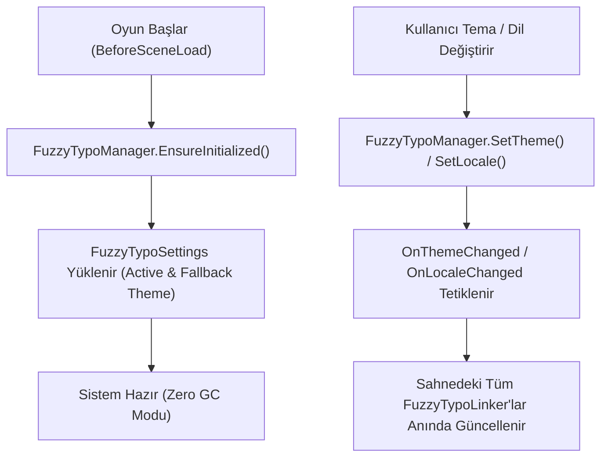

# 11. Çalışma Zamanı API & Scripting

[← Önceki Bölüm: Bağımsız Editör Araçları](10-standalone-tools.md) | [Ana Sayfa](README.md) | [Sonraki Bölüm: Sıkça Sorulan Sorular & Sorun Giderme →](12-faq-and-troubleshooting.md)

---

## ⚡ Çalışma Zamanı (Runtime) Mimarisi

FuzzyTypo'nun çalışma zamanı omurgasını **`FuzzyTypoManager`** statik sınıfı oluşturur.

Oyun başladığında (`BeforeSceneLoad` anında) otomatik olarak yapılandırma ayarlarını yükler (`AutoInitialize`), aktif temayı önbelleğe alır ve sahneler arası geçişlerde sıfır GC ile çalışır.



---

## 📖 `FuzzyTypoManager` API Referansı

### Özellikler (Properties):
* `FuzzyTheme ActiveTheme`: Çalışma zamanında geçerli olan aktif tema. Değer atandığında otomatik olarak `OnThemeChanged` olayını tetikler.
* `FuzzyTheme FallbackTheme`: Aktif temada bir stil bulunamazsa sorgulanacak kurtarma teması.
* `string CurrentLocale`: Aktif ISO dil kodu (Örn: `"en"`, `"tr"`, `"ja"`).
* `bool IsInitialized`: Sistemin ilk yüklemesinin tamamlanıp tamamlanmadığını belirtir.

### Olaylar (Events):
```csharp
// Tema değiştiğinde tetiklenir (0 Byte GC Alloc)
public static event Action<FuzzyTheme> OnThemeChanged;

// Dil değiştiğinde tetiklenir (0 Byte GC Alloc)
public static event Action<string> OnLocaleChanged;

// Herhangi bir stil parametresi değiştiğinde tetiklenir
public static event Action OnTypographyChanged;
```

### Metotlar (Methods):
* `FuzzyTextStyle GetStyle(string styleId)`: Verilen GUID ID'ye sahip stili **$O(1)$** sürede döner.
* `void SetTheme(FuzzyTheme theme)`: Aktif temayı doğrudan referans ile değiştirir.
* `bool SetThemeByName(string themeName)`: Settings içindeki temalardan isme göre arayarak aktif temayı değiştirir.
* `void SetLocale(string localeCode)`: Dili değiştirir ve linkırlara bildirim gönderir.
* `void NotifyTypographyChanged()`: Stillerin güncellendiğini duyurur.

---

## 💻 Pratik Kod Örnekleri

### Örnek 1: Oyun İçi Tema Değiştirme (Dark / Light Theme Toggle)
```csharp
using UnityEngine;
using UnityEngine.UI;
using FuzzyLogicLabs.FuzzyTypo;

public class UIThemeController : MonoBehaviour
{
    [SerializeField] private FuzzyTheme m_DarkTheme;
    [SerializeField] private FuzzyTheme m_LightTheme;

    public void ToggleTheme(bool isDark)
    {
        if (isDark)
        {
            FuzzyTypoManager.SetTheme(m_DarkTheme);
        }
        else
        {
            FuzzyTypoManager.SetTheme(m_LightTheme);
        }
    }

    public void ToggleThemeByName(string themeName)
    {
        // Temayı ayarlardan isme göre bulup uygular
        FuzzyTypoManager.SetThemeByName(themeName);
    }
}
```

### Örnek 2: Dinamik Metin Üretimi (Instantiate & Link)
Oyun esnasında kod ile hasar yazısı (Floating Damage Text) veya envanter kartı ürettiğinizde stili nasıl bağlarsınız:

```csharp
using UnityEngine;
using TMPro;
using FuzzyLogicLabs.FuzzyTypo;

public class DamageTextSpawner : MonoBehaviour
{
    [SerializeField] private GameObject m_DamageTextPrefab;

    public void SpawnDamage(Vector3 position, int amount, bool isCritical)
    {
        GameObject textObj = Instantiate(m_DamageTextPrefab, position, Quaternion.identity);
        TMP_Text tmp = textObj.GetComponent<TMP_Text>();
        tmp.text = amount.ToString();

        // Stili dinamik bağlama
        FuzzyTypoLinker linker = textObj.GetComponent<FuzzyTypoLinker>();
        if (linker != null)
        {
            string targetStyleName = isCritical ? "Display / Critical Damage" : "Body / Damage";
            FuzzyTextStyle style = FuzzyTypoManager.ActiveTheme.GetStyleByName(targetStyleName);
            if (style != null)
            {
                linker.StyleId = style.Id; // Stili atar ve ApplyStyle() otomatik çalışır
            }
        }
    }
}
```

### Örnek 3: Tema Değişim Olayını Dinleme
```csharp
using UnityEngine;
using FuzzyLogicLabs.FuzzyTypo;

public class CustomUIElement : MonoBehaviour
{
    private void OnEnable()
    {
        FuzzyTypoManager.OnThemeChanged += HandleThemeChanged;
    }

    private void OnDisable()
    {
        FuzzyTypoManager.OnThemeChanged -= HandleThemeChanged;
    }

    private void HandleThemeChanged(FuzzyTheme newTheme)
    {
        Debug.Log($"Yeni tema aktif edildi: {newTheme.ThemeName}");
        // Özel animasyon veya ses efekti tetikleyebilirsiniz
    }
}
```

---

## 🎮 İnteraktif Çalışma Zamanı Test Paneli (FuzzyTypoRuntimeDemo)

Paket içerisinde, çalışma zamanında tema ve dil geçişlerini Play Mode esnasında test edebilmeniz için **`FuzzyTypoRuntimeDemo`** bileşeni yer almaktadır.


### Özellikler:
* **Sürüklenebilir Pencere (Draggable Window):** Başlık çubuğundan tutarak ekranın dilediğiniz köşesine taşıyabilirsiniz.
* **Daraltılabilir (Collapse / Expand):** Oyun ekranınızı kapatmaması için tek tıkla simge durumuna küçültebilirsiniz.
* **Canlı Tema Butonları:** 🌙 Dark Theme ve ☀ Light Theme butonlarıyla sıfır gecikmeli geçiş.
* **Çok Dilli Test:** `EN`, `TR`, `JA (CJK)`, `DE`, `AR` dilleri arasında anında geçiş yaparak metin sığma ve CJK karakter testleri yapabilirsiniz.

---

[← Önceki Bölüm: Bağımsız Editör Araçları](10-standalone-tools.md) | [Ana Sayfa](README.md) | [Sonraki Bölüm: Sıkça Sorulan Sorular & Sorun Giderme →](12-faq-and-troubleshooting.md)
