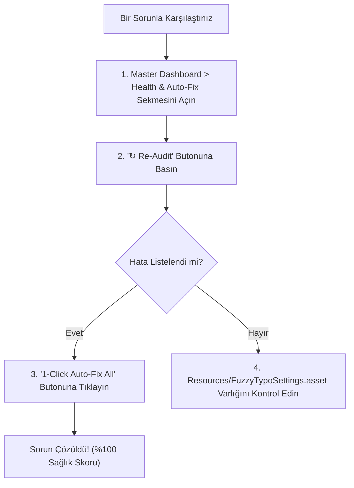

# 12. Sıkça Sorulan Sorular & Sorun Giderme

[← Önceki Bölüm: Çalışma Zamanı API & Scripting](11-runtime-api-and-scripting.md) | [Ana Sayfa](README.md)

---

## ❓ Sıkça Sorulan Sorular (SSS)

### 1. Neden bazı karakterler ekranda boş kutucuk (`□`) veya soru işareti olarak görünüyor?
* **Neden:** Kullandığınız ana font atlasında ilgili karakter (Türkçe `ş, ğ, ı`, Japonca Kanji/Hiragana veya semboller) yer almıyor.
* **Çözüm:**  
  1. Master Dashboard'un **Health & Auto-Fix** sekmesini açın.
  2. Sağ üstteki **"1-Click Auto-Fix All Issues"** butonuna basın.
  3. Sistem otomatik olarak işletim sistemindeki zengin fontlardan bir Fallback Font (`FuzzyCJK SDF` veya `FuzzySymbols SDF`) üretecek ve fontunuza bağlayacaktır.

---

### 2. Stil adını (Örn: "Heading 1" yerine "H1 / Main Title") değiştirirsem sahne veya prefab bağlantıları kopar mı?
* **Cevap:** **Kesinlikle hayır!**  
  FuzzyTypo, isim tabanlı değil **GUID tabanlı (Immutable Unique Identifier)** eşleşme mimarisine sahiptir. Stilin adını, kategorisini veya açıklamasını dilediğiniz gibi güncelleyebilirsiniz; sahnelerinizdeki referanslar asla bozulmaz.

---

### 3. FuzzyTypo'nun oyunumun performansına (FPS) veya bellek kullanımına olumsuz bir etkisi olur mu?
* **Cevap:** **Hayır, tam aksine performansı artırır.**
  * Çalışma zamanında (Runtime) `FuzzyTypoLinker` bileşeninde hiçbir `Update()` döngüsü bulunmaz.
  * Olaylar tamamen C# statik delegeleriyle tetiklenir ve **sıfır bellek çöpü (0 Byte GC Alloc)** üretir.
  * Ayrıca **Bake & Strip (Pro)** modunu etkinleştirdiğinizde, oyun derlenirken (Release Build) tüm linker scriptleri sahneden silinir ve değerler doğrudan TMP'ye yazılır. Cihazda sıfır ek bellek veya kod yükü kalır.

---

### 4. Unity 6 (6000.x) ile tam uyumlu mu?
* **Cevap:** **Evet, %100 uyumludur.**
  * Unity 6 ile yürürlüğe giren `FindObjectsByType` API güncellemeleri yerleşik olarak desteklenir; konsolda eski API uyarısı (deprecation warning) çıkmaz.
  * Unity 6'nın çok çekirdekli font engine kısıtlamalarına karşı `FuzzyTypoFontSetup` otomatik koruma mekanizmasına sahiptir.

---

### 5. Figma veya harici tasarım sistemlerindeki token'larımı nasıl aktarırım?
* **Cevap:**  
  1. Dashboard'da **Settings & Pro** sekmesine gidin.
  2. **Tokens Interoperability** kartındaki **"Import JSON..."** butonuna tıklayın.
  3. W3C DTCG veya Tokens Studio uyumlu JSON dosyanızı seçtiğinizde stiller projenize aktarılır.

---

### 6. Bir buton metninin rengini kırmızı yapmak istiyorum ama font boyutu stilden gelsin, ne yapmalıyım?
* **Cevap:**  
  İlgili metin nesnesinin Inspector'ında `FuzzyTypoLinker` bileşeni altındaki **Local Overrides** bölümünden **"Color"** onay kutusunu işaretleyin. Artık o nesnenin rengi bağımsız kalırken diğer tüm tipografi özellikleri merkezi stilden senkronize edilmeye devam eder.

---

## 🛠️ Sorun Giderme Kılavuzu (Troubleshooting)

| Karşılaşılan Durum | Olası Neden | Önerilen Çözüm |
| :--- | :--- | :--- |
| **"Unable to load FuzzyTypoSettings" hatası** | `Resources` klasöründeki ayar dosyası taşınmış veya silinmiş. | `Window > Fuzzy Logic Labs > FuzzyTypo > Master Dashboard` açıldığında sistem ayar dosyasını otomatik olarak yeniden üretir. |
| **Sahnedeki metinler stili değiştirmeme rağmen güncellenmiyor** | `Auto Live Sync in Editor` seçeneği kapatılmış olabilir. | Dashboard **Settings & Pro** sekmesinden veya `Project Settings > FuzzyTypo` altından bu ayarın açık (`true`) olduğunu doğrulayın. |
| **Prefab varyantlarında yaptığım değişiklikler sahne kapanınca gidiyor** | Prefab kayıt hatası. | FuzzyTypo otomatik olarak `PrefabUtility.RecordPrefabInstancePropertyModifications` çağırır. Sahneyi kaydettiğinizden (`Ctrl+S`) emin olun. |
| **Atlas dokusu çok bulanık görünüyor** | TextMeshPro SDF Sampling Point Size değeri düşük oluşturulmuş. | Font asset'ini TMP Font Asset Creator ile daha yüksek atlas çözünürlüğünde (Örn: `1024x1024` veya `2048x2048`) yeniden oluşturun. |

---

## 🚀 Yayın Öncesi Kontrol Listesi (Pre-Release Checklist)

Oyununuzu son kullanıcıya (Steam, App Store, Google Play, Konsol) göndermeden önce şu 5 adımı tamamlayın:

- [ ] **1. Sağlık Denetimi:** Linter üzerinden tüm sahneleri taratıp `%100 Compliant` skorunu doğrulayın.
- [ ] **2. Font Bellek Kontrolü:** `Insights & Analytics` sekmesinden `[Unused]` olarak işaretlenmiş kullanılmayan dev font atlaslarını silerek derleme boyutunu küçültün.
- [ ] **3. Glif Denetimi:** Oyununuzun desteklediği diller (Türkçe, Almanca, CJK vb.) için `Glyph Analyzer` testini çalıştırın.
- [ ] **4. Bake & Strip Tercihi:** Eğer çalışma zamanında tema değiştirmeyecekseniz `Strip Linkers on Build` ayarını açarak sıfır ek bellek modunu aktif edin.
- [ ] **5. Çok Dilli Test:** `FuzzyTypoRuntimeDemo` panelini kullanarak diller arası geçişlerde metin taşması olmadığını teyit edin.

---

[← Önceki Bölüm: Çalışma Zamanı API & Scripting](11-runtime-api-and-scripting.md) | [Ana Sayfa](README.md)
