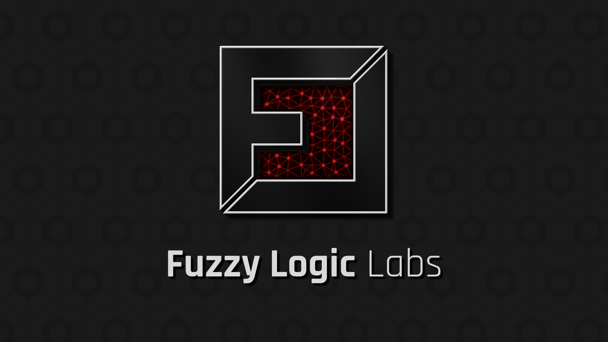
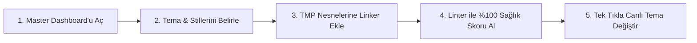

# FuzzyTypo - Kapsamlı Dokümantasyon

> **Unity için Merkezi Tipografi ve Tasarım Sistemi (Design Tokens) Yönetim Paketi**  
> *Sürüm:* `1.0.0` | *Geliştirici:* **Fuzzy Logic Labs** | *Platform:* Unity 2021.3 LTS, 2022.3 LTS, 2023.2 ve Unity 6+ (Unity 6000.x)  
> *Destek & İletişim:* [devbayk@gmail.com](mailto:devbayk@gmail.com) | [Discord Topluluğu](https://discord.gg/CGpunqn49e) | [Resmi Web Sitesi](https://fatihbykl.github.io/docs/fuzzytypo/)

---

## 📖 Dokümantasyon İçindekiler Tablosu

Bu dokümantasyon, **FuzzyTypo** aracının tüm bileşenlerini, editör araçlarını, çalışma zamanı API'lerini ve ileri düzey optimizasyon mekanizmalarını adım adım anlatmaktadır:

| Bölüm | Konu Başlığı | Açıklama |
| :--- | :--- | :--- |
| **[01. Giriş ve Kurulum](01-introduction-and-setup.md)** | Başlangıç & Konfigürasyon | Sistem gereksinimleri, paket kurulumu, Welcome penceresi ve Project Settings ayarları. |
| **[02. Temel Kavramlar ve Mimari](02-core-concepts-and-architecture.md)** | Mimari Prensipler | Design Tokens mimarisi, `FuzzyTheme`, `FuzzyTextStyle`, GUID tabanlı eşleşme ve Zero-GC vizyonu. |
| **[03. FuzzyTypoLinker Bileşeni](03-fuzzytypo-linker.md)** | Metin Köprüsü | `FuzzyTypoLinker` çalışma döngüsü, Inspector arayüzü, Live Sync, Local Override bayrakları ve prefab güvenliği. |
| **[04. Master Dashboard: Tokens Studio](04-master-dashboard-tokens-studio.md)** | Sekme 1: Stil Tasarımı | Tema yönetimi, Style Inspector, Modüler Tipografi Skalası (Type Scale Generator), Canlı Önizleme Tuvali ve Usage Explorer. |
| **[05. Master Dashboard: Scene Governance](05-master-dashboard-scene-governance.md)** | Sekme 2: Sahne Denetimi | Sahne/Prefab taraması, Hiyerarşik UI Rol Tespiti (Context Roles), Toplu Seçim, Smart Auto-Link ve Pagination. |
| **[06. Master Dashboard: Health & Auto-Fix](06-health-and-autofix-studio.md)** | Sekme 3: Linter & Onarım | `FuzzyTypographyLinter`, Sağlık Skoru (%0-100 Gauge), Hata ve Uyarı Analizi, 1-Click Auto-Fix All motoru. |
| **[07. Master Dashboard: Insights & Analytics](07-insights-and-analytics.md)** | Sekme 4: Analitik & Varlıklar | `FuzzyFontAnalytics` (Atlas bellek ağırlığı ve boyutları), `FuzzyPrefabAnalytics` (Kapsama matrisi) ve Safe Font Replacer. |
| **[08. Master Dashboard: Settings & Pro](08-settings-and-pro-features.md)** | Sekme 5: Pro & Optimizasyon | JSON Token Değişimi (Figma / W3C DTCG Formatı), Bake & Strip derleme optimizasyonu ve Demo Sahnesi Oluşturucu. |
| **[09. Çok Dilli Tipografi & Yerelleştirme](09-localization-and-multilingual.md)** | Global Dil Desteği | `LocaleOverride`, `FuzzyLocalizationProfile`, `FuzzyGlyphFixer` ile otomatik CJK & Sembol Fallback font üretimi. |
| **[10. Bağımsız Editör Araçları](10-standalone-tools.md)** | Yardımcı Editör Araçları | Auto-Migrator (Eski TMP'leri dönüştürme), Glyph Analyzer (Karakter seti denetimi) ve Batch Material Swapper. |
| **[11. Çalışma Zamanı API & Scripting](11-runtime-api-and-scripting.md)** | Runtime API Rehberi | `FuzzyTypoManager` olayları/metotları, C# ile anlık tema & dil değiştirme, Zero-GC ilkeleri ve Runtime Demo Paneli. |
| **[12. Sıkça Sorulan Sorular & Sorun Giderme](12-faq-and-troubleshooting.md)** | Hata Çözümü & İpuçları | Yaygın karşılaşılan durumlar, font atlas bozulmaları, performans optimizasyonu ve en iyi pratikler. |
| **[Ek: Görsel Yer Tutucuları Listesi](images/README.md)** | Medya Kılavuzu | Dokümantasyonda kullanılan ekran görüntüsü yer tutucularının tam listesi ve önerilen boyutlar. |

---

## ⚡ Hızlı Başlangıç (5 Dakikada FuzzyTypo)

FuzzyTypo'yu projenizde kullanmaya başlamak son derece kolaydır:

### 1. Master Dashboard'u Açın
Unity üst menüsünden **Window > Fuzzy Logic Labs > FuzzyTypo > Master Dashboard** yolunu izleyin veya `Ctrl+Shift+T` (macOS: `Cmd+Shift+T`) kısayolunu kullanın.

### 2. Hazır Örnek Temaları Üretin (Opsiyonel)
Dashboard'un **Settings & Pro** sekmesine gidin ve **"Generate Starter Themes"** butonuna tıklayın. Saniyeler içinde modern `SampleDarkTheme` ve `SampleLightTheme` varlıkları üretilecek ve projenize tanıtılacaktır.

### 3. Metin Nesnenizi Bağlayın
Hiyerarşide bulunan herhangi bir `TextMeshProUGUI` veya `TextMeshPro` nesnesine **Add Component > Fuzzy Typo Linker** ekleyin ve açılır menüden bir stil seçin (Örn: `Headings / H1 Hero Display`).

### 4. Canlı Senkronizasyonu İzleyin
Dashboard üzerinden stilin font boyutunu, rengini veya satır aralığını değiştirdiğiniz anda sahnedeki tüm bağlı metinlerin anında güncellendiğini görün!

---

## 🌟 Öne Çıkan Temel Yetenekler

* **Merkezi Tasarım Sistemi (Design Tokens):** Tek bir tıkla tüm projenin başlık, gövde, buton ve istatistik font parametrelerini güncelleyin.
* **Sıfır GC Alloc (Zero Garbage Collection):** Çalışma zamanında `Update` döngüsü çalıştırmaz. Sadece olay tabanlı (event-driven) çalışır ve GC çöp üretmez.
* **UI Toolkit Tabanlı Modern Dashboard:** Unity 6 ve modern Unity editör arayüzü standartlarına tam uyumlu, akıcı, modern karanlık tema arayüzü.
* **1-Click Auto-Fix & Linter:** Sahnedeki başıboş fontları, bağlanmamış metinleri ve eksik glifleri otomatik tespit eder ve tek tıkla %100 Tasarım Sistemi Sağlık Skoruna ulaştırır.
* **Akıllı Otomatik Fallback & CJK Üretimi:** Japonca, Çince, Korece veya özel semboller içeren metinler için işletim sistemi fontlarından otomatik TMP SDF Fallback fontları oluşturur ve bağlar.
* **Bake & Strip Pro Optimizasyonu:** Oyuncu build'i (Release) alınırken linker bileşenlerini sıyırarak cihazda sıfır ek bellek veya script yükü bırakır.
* **Figma & JSON Birlikte Çalışabilirlik:** W3C DTCG standartlarında JSON formatıyla Figma tasarımcılarıyla token alışverişi yapın.

---

> [!TIP]
> Projenizi hemen keşfetmeye başlamak için **[01. Giriş ve Kurulum](01-introduction-and-setup.md)** sayfasıyla devam edebilirsiniz.
