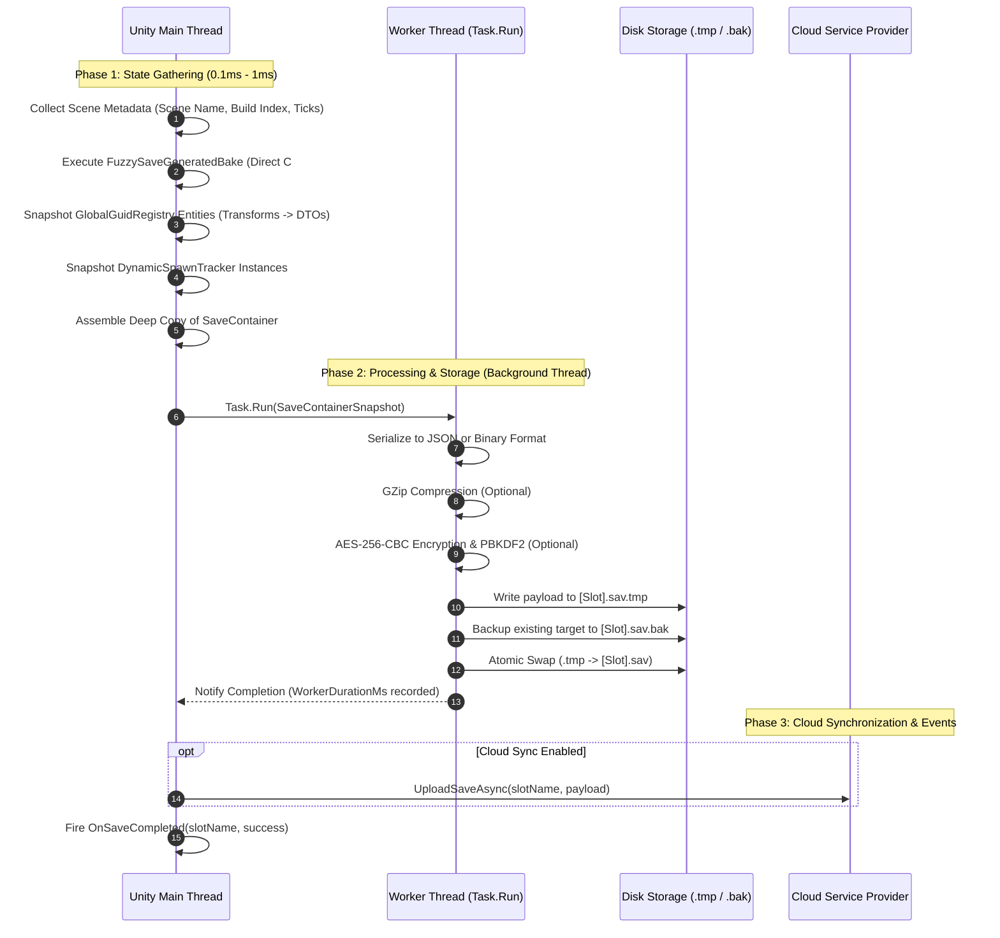
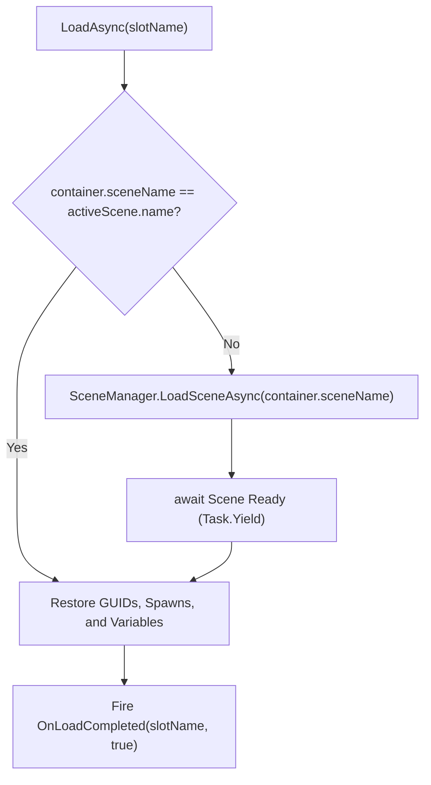

## The Core Problem: Why Conventional Systems Stutter

Unity's rendering loop is bound to the **Main Thread**. In standard implementations, calling `Save()` performs the following on the main thread:
1. Crawling game objects and reflection reading.
2. Converting data structures into large JSON or binary strings.
3. Compressing with GZip / Deflate.
4. Performing cryptographic hashing and AES encryption.
5. Invoking synchronous file disk I/O (`File.WriteAllText`).

If the save payload is larger than a few kilobytes, the main thread freezes for **20ms to 250ms+**, causing a noticeable dropped frame (lag spike / hitch).

FuzzySave eliminates this with its **3-Phase Asynchronous Pipeline**.

---

## The 3-Phase Pipeline Architecture



---


*Unity Profiler demonstrating zero frame drops during a background write of 1,000+ entities with encryption enabled.*

---

## Phase Breakdown

### Phase 1: Main Thread Gathering (~0.1ms – 1.0ms)
Because Unity's C++ native bindings (`Transform`, `GameObject`, `Component`, `SceneManager`) can only be touched from the main thread, Phase 1 strictly gathers data and maps it into thread-safe Plain Old C# Objects (POCOs) and DTOs:
- Collects active scene name, build index, UTC timestamp, and playtime.
- Direct C# property reads via `FuzzySaveGeneratedBake`.
- Converts transforms and rigidbodies into stack-allocated DTO structs (`Vector3DTO`, `QuaternionDTO`, `TransformDTO`).
- Clones a deep copy snapshot of `SaveContainer`.

### Phase 2: Background Worker Processing (`Task.Run`)
All CPU-intensive, allocation-heavy, and disk-bound work runs asynchronously on the .NET thread pool:
- **Serialization:** Full transformation to JSON or Binary without blocking Unity.
- **Compression:** GZip byte stream compression.
- **Encryption:** AES-256-CBC with PBKDF2 cached keys.
- **Atomic I/O:** Flushes to temporary file `.tmp`, validates, creates `.bak` fallback, and atomically swaps file names.

### Phase 3: Cloud Sync & Event Dispatch
Once local disk operations conclude:
- The system returns execution safely to Unity's SynchronizationContext.
- If cloud synchronization is configured, `CloudSyncManager` asynchronously uploads payload bytes in the background.
- Global event `FuzzySaveManager.OnSaveCompleted` fires on the main thread for UI toast feedback.

---

## Time-Sliced Restoration (Zero-Hitch Loading)

Loading thousands of objects within a single frame can cause an even worse freeze than saving. FuzzySave resolves this using an adaptive **Time-Sliced Restoration Engine**:

```csharp
// Excerpt from CoreEngine.cs (LoadAsync)

// 1. Scene GUID Objects: Yield every 500 items to avoid frame hitches
if (s_CurrentContainer.guidObjects != null && s_CurrentContainer.guidObjects.Count > 0)
{
    int guidBatchCounter = 0;
    for (int i = 0; i < s_CurrentContainer.guidObjects.Count; i++)
    {
        var data = s_CurrentContainer.guidObjects[i];
        if (GlobalGuidRegistry.TryGet(data.guid, out var targetComp))
        {
            data.ApplyTo(targetComp);
        }

        guidBatchCounter++;
        if (guidBatchCounter >= 500)
        {
            guidBatchCounter = 0;
            await Task.Yield(); // Hands frame control back to Unity!
        }
    }
}

// 2. Dynamic Prefab Spawns: Yield every 50 instantiations
if (s_CurrentContainer.dynamicSpawns != null && s_CurrentContainer.dynamicSpawns.Count > 0)
{
    int spawnBatchCounter = 0;
    for (int i = 0; i < s_CurrentContainer.dynamicSpawns.Count; i++)
    {
        var spawnData = s_CurrentContainer.dynamicSpawns[i];
        // Instantiate prefab, set GUID, and apply transform & physics...

        spawnBatchCounter++;
        if (spawnBatchCounter >= 50)
        {
            spawnBatchCounter = 0;
            await Task.Yield(); // Prevents GC and engine instantiation stall!
        }
    }
}
```

---

## Cross-Scene Restoration

When loading a save slot created in a different scene, FuzzySave handles scene transitions seamlessly:



If `container.sceneName != activeScene.name`, FuzzySave:
1. Calls `SceneManager.LoadSceneAsync(container.sceneName)`.
2. Asynchronously waits until the new scene has fully loaded.
3. Automatically maps scene objects and dynamic prefabs to the newly loaded hierarchy.
4. Restores character position, inventory, and health without requiring custom scene transition code.

---

## Live Performance Profiling Metrics

FuzzySave exposes real-time profiling metrics directly on `FuzzySaveManager`:

```csharp
// Inspect execution timings in milliseconds
float mainThreadMs = FuzzySaveManager.LastSaveMainThreadGatherMs;
float workerThreadMs = FuzzySaveManager.LastSaveWorkerDurationMs;

Debug.Log($"Main Thread Gathering: {mainThreadMs:F2} ms | Background Worker I/O: {workerThreadMs:F2} ms");
```

---

## Next Chapter

Proceed to [03. Storage, Security & Data Integrity](/docs/fuzzysave/storage-and-security/) to explore atomic file operations, AES-256 encryption, GZip compression, and HMAC-SHA256 checksums.
