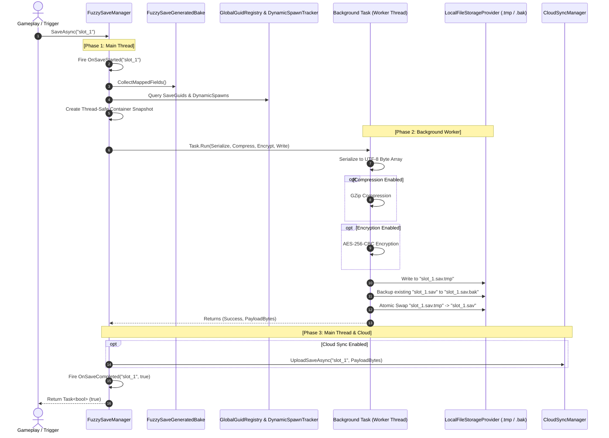
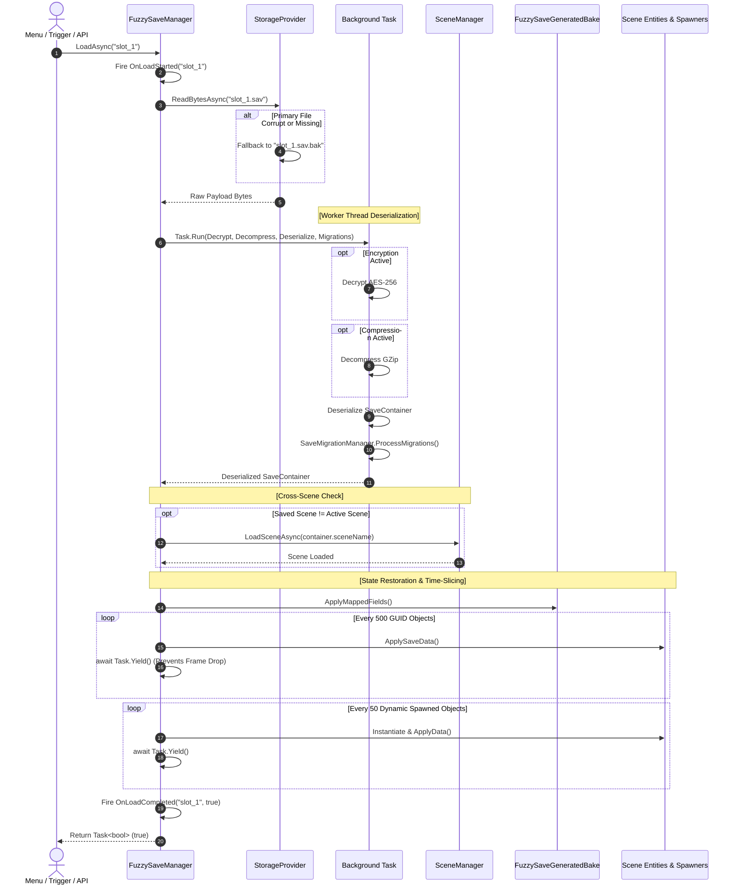

## 1. Introduction

**FuzzySave** is an enterprise-grade, high-performance Save & Load architecture designed for Unity projects ranging from agile indie titles to massive open-world productions. Traditional Unity save approaches often suffer from fundamental architectural flaws:
* **`PlayerPrefs`:** Limited to primitive types, prone to corruption during sudden app suspension, synchronous disk writes that cause frame hitching, and easily manipulated by players via Windows Registry or plist files.
* **Ad-hoc `File.WriteAllText(JsonUtility...)`:** Lacks crash safety (a crash midway writes a corrupt 0-byte file), lacks atomic swaps, lacks automatic rolling backups, lacks background thread offloading, and creates significant Garbage Collection (GC) pressure.
* **Heavy Reflection-Based Serializers:** Slow reflection traversal at runtime causing noticeable micro-stutters, especially on mobile and standalone VR devices.

FuzzySave eliminates these bottlenecks by introducing a **hybrid architecture**:
1. **Visual No-Code Tooling:** Complete UI Toolkit editor suite (**Visual Save Studio**) for scene scanning, mapping, and authoring save groups without writing code.
2. **Code Baking:** Pre-generates type-safe static C# serialization bindings (`FuzzySaveGeneratedBake`), removing runtime reflection costs.
3. **Crash-Resilient I/O:** Multi-phase atomic write pipeline with temporary staging files (`.tmp`), rolling backups (`.bak`), and atomic swapping.
4. **Zero-Allocation Data Adapters:** DTOs (Data Transfer Objects) for all Unity primitives (`Vector3`, `Quaternion`, `Color`, `Transform`, etc.).
5. **Multi-Threaded Asynchronous Core:** Heavy JSON/Binary serialization, AES-256 encryption, and GZip compression run entirely on background worker threads via `Task.Run()`, leaving the Unity Main Thread completely free from frame-rate drops.

---

## 2. Architectural Layers

FuzzySave is divided into 6 distinct, decoupled layers:

```mermaid
graph TD
    subgraph "Layer 1: Visual Authoring & Editor"
        VSS["Visual Save Studio (UI Toolkit)"]
        LiveDbg["Play Mode Live Debugger"]
        Scanner["Auto-Discovery Scanner"]
        Emitter["PartialClassEmitter (CodeGen)"]
    end

    subgraph "Layer 2: Runtime Components (No-Code)"
        SaveTrig["SaveTriggerZone (2D & 3D)"]
        BtnBind["SaveButtonBinding"]
        KeyBind["SaveKeyBinding (Quick Save / Load)"]
        AutoMgr["AutoSaveManager (Rolling Slots)"]
        Feedback["SaveFeedbackUI (Toasts & Spinners)"]
        ActionTrig["SaveActionTrigger (UnityEvents)"]
    end

    subgraph "Layer 3: Tracking & Scene Entities"
        SGuid["SaveGuid (Static Registry & Delta Checks)"]
        DSpawn["DynamicSpawnTracker (Instantiated Entities)"]
        GuidReg["GlobalGuidRegistry"]
    end

    subgraph "Layer 4: Core Engine Orchestrator"
        FSM["FuzzySaveManager (Static Facade API)"]
        SnapCache["In-Memory Snapshots (Time-Travel)"]
        Migrate["SaveMigrationManager"]
        Settings["FuzzySaveSettings (ScriptableObject)"]
    end

    subgraph "Layer 5: Serialization & Security"
        SerEng["JsonSaveSerializer / BinarySaveSerializer"]
        DTOs["DTO Adapters (Zero-Allocation)"]
        RefConv["Reference Converters (SO / GameObject)"]
        AES["EncryptionHandler (AES-256-CBC)"]
        HMAC["ChecksumHandler (HMAC-SHA256)"]
        GZip["CompressionHandler (GZipStream)"]
    end

    subgraph "Layer 6: Physical Storage & Cloud"
        Storage["LocalFileStorageProvider (Atomic I/O)"]
        CloudMgr["CloudSyncManager"]
        Providers["UGS / Steam / PlayFab / Firebase / REST"]
    end

    VSS --> Emitter
    VSS --> Scanner
    SaveTrig --> FSM
    BtnBind --> FSM
    KeyBind --> FSM
    AutoMgr --> FSM
    ActionTrig --> FSM
    SGuid --> GuidReg
    DSpawn --> FSM
    FSM --> GuidReg
    FSM --> SnapCache
    FSM --> Migrate
    FSM --> SerEng
    SerEng --> DTOs
    SerEng --> RefConv
    FSM --> AES
    FSM --> HMAC
    FSM --> GZip
    FSM --> Storage
    FSM --> CloudMgr
    CloudMgr --> Providers
```



---

## 3. Asynchronous Save & Load Pipeline

The execution flow of FuzzySave is designed with a strict **3-Phase Separation of Concerns**:
* **Phase 1 (Main Thread):** Fast state gathering. Interrogates GameObjects, transforms, registered components, and baked field accessors. Must execute in less than 1-2 milliseconds.
* **Phase 2 (Background Thread):** Heavy compute offloaded to thread-pool tasks. Handles DTO serialization, JSON/Binary encoding, GZip compression, AES-256 encryption, `.tmp` file writing, and atomic renaming.
* **Phase 3 (Post-Processing & Cloud):** Fires completion delegates on the main thread, updates UI feedback toasts, and optionally initiates asynchronous cloud sync.

### Asynchronous Save Lifecycle



---

## 4. Asynchronous Load & Cross-Scene Restoration Pipeline

When loading a save file, FuzzySave not only deserializes data, but also handles **scene transitions** and **time-sliced entity re-instantiation**:



---

## 5. Assembly Definitions & Package Structure

FuzzySave enforces strict assembly boundaries to prevent editor code from leaking into runtime player builds:

```
Assets/FuzzyLogicLabs/FuzzySave/
├── Runtime/
│   ├── FuzzySave.Runtime.asmdef         <-- Runtime engine definition
│   ├── Attributes/                      <-- Declarative save annotations
│   ├── Components/                      <-- No-code MonoBehaviour components
│   ├── Core/                            <-- FuzzySaveManager, Settings, Migrations, CloudSync
│   ├── DTO/                             <-- Zero-allocation data transfer structs
│   ├── Generated/                       <-- FuzzySaveGenerated.cs (Auto-baked static bindings)
│   ├── Security/                        <-- AES-256, Checksum, GZip
│   ├── Serialization/                  <-- JSON/Binary serializers & reference converters
│   ├── Storage/                         <-- LocalFileStorageProvider (Atomic I/O)
│   └── Tracking/                        <-- SaveGuid, DynamicSpawnTracker, GlobalGuidRegistry
│
├── Editor/
│   ├── FuzzySave.Editor.asmdef          <-- Editor-only definition (References Runtime)
│   ├── CodeGen/                         <-- PartialClassEmitter & SaveMetadataSO
│   ├── CodeMod/                         <-- CodeRewriter (Regex AST modifications)
│   ├── Debugger/                        <-- PlayModeLiveDebuggerWindow (UI Toolkit)
│   ├── Inspectors/                      <-- Custom inspectors for components
│   ├── Scanners/                        <-- AutoDiscoveryEngine
│   └── VisualSaveStudio/                <-- VisualSaveStudioWindow (UI Toolkit)
│
├── Samples/                             <-- Complete playable sample project
└── Tests/                               <-- NUnit PlayMode and EditMode test suites
```

### Dependency Graph

* **`FuzzySave.Runtime.asmdef`**: Zero external package dependencies. Relies only on Unity Core and `Newtonsoft.Json` (Unity's com.unity.nuget.newtonsoft-json).
* **`FuzzySave.Editor.asmdef`**: References `FuzzySave.Runtime`. Includes UI Toolkit, reflection scanners, code generation emitters, and inspector decorators.
* **`FuzzySave.Tests.asmdef`**: References both Runtime and Editor assemblies with NUnit test frameworks enabled.

---

## 6. Quick Setup & Configuration

1. **Locate or Create Settings:**
   Navigate to `Assets/FuzzyLogicLabs/FuzzySave/Resources/FuzzySaveSettings.asset`. If it does not exist, open **Tools > FuzzySave > Visual Save Studio**; the window automatically generates a default settings asset in `Resources/`.
2. **Configure Basic Options:**
   * **Save Folder Name:** Name of the subdirectory inside `Application.persistentDataPath` (default: `FuzzySaveData`).
   * **Default Format:** `Json` (human-readable, ideal for debugging) or `Binary` (compact).
   * **Enable Backup:** `true` (enables automatic `.bak` recovery).
   * **Enable Encryption:** Toggle on and set your secret passphrase.
   * **Enable Compression:** Toggle on for GZip compression.
3. **Verify Assembly References:**
   Ensure your game assemblies reference `FuzzySave.Runtime`.
