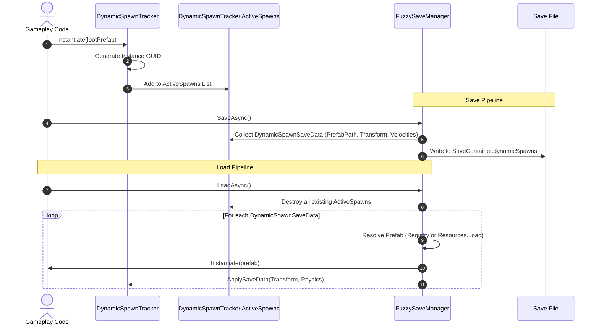

## 1. Static Scene Entities (`SaveGuid.cs`)

In any non-trivial game, numerous objects are placed directly into the scene hierarchy during level design:
* Treasure chests that have been opened or remain locked.
* Doors, gates, and elevator platforms with specific states and positions.
* Collectible coins, lore books, and puzzle pedestals.
* Destroyed or deactivated world barriers.

Traditional save systems struggle with scene objects because Unity’s internal instance IDs (`GetInstanceID()`) change every time a scene is reloaded. FuzzySave resolves this using the `SaveGuid` component and `GlobalGuidRegistry`.

### 1.1 Automatic GUID Generation & Duplicate Resolution

When a `SaveGuid` component is attached to any GameObject:
1. **Auto-Assignment:** A persistent 128-bit `System.Guid` string is generated and stored in serialized field `m_Guid`.
2. **Duplicate Detection:** If a designer duplicates an object in the Unity hierarchy (via `Ctrl+D` or copy-paste), both objects initially share the same GUID. `SaveGuid.OnValidate()` automatically scans the scene, detects the collision, and assigns a brand-new unique GUID to the cloned instance.
3. **Prefab Disk Protection:** `SaveGuid` ensures that project prefab assets on disk (`PrefabUtility.IsPartOfPrefabAsset`) are not assigned scene-specific runtime GUIDs.

### 1.2 Fine-Grained `SaveFlags` Bitmask

Rather than indiscriminately saving every transform matrix, `SaveGuid` allows developers to specify exact properties via bitwise flags:

```csharp
[Flags]
public enum SaveFlags
{
    None           = 0,
    Position       = 1 << 0,  // (1) Save world position
    Rotation       = 1 << 1,  // (2) Save rotation quaternion
    Scale          = 1 << 2,  // (4) Save local scale
    ActiveState    = 1 << 3,  // (8) Save gameObject.activeSelf
    RigidbodyState = 1 << 4,  // (16) Save linear & angular velocity
    CustomState    = 1 << 5,  // (32) Save custom JSON state string
    All            = Position | Rotation | Scale | ActiveState | RigidbodyState | CustomState
}
```

* **Collectible Coins:** Set `SaveFlags = ActiveState`. If the coin was collected (`SetActive(false)`), only 1 boolean byte is stored.
* **Movable Boulder:** Set `SaveFlags = Position | Rotation | RigidbodyState`.
* **Static Chest:** Set `SaveFlags = CustomState` (stores open/closed animation state).

### 1.3 Delta Skipping via `PositionThreshold`

Static scene objects rarely move continuously. `SaveGuid` implements delta skipping:
```csharp
public bool HasTransformChangedSignificantly()
{
    float posDiff = Vector3.SqrMagnitude(transform.position - m_LastSavedPosition);
    float rotDiff = Quaternion.Angle(transform.rotation, m_LastSavedRotation);
    return posDiff > (m_PositionThreshold * m_PositionThreshold) || rotDiff > 0.01f;
}
```
If an object moves less than `m_PositionThreshold` (default: `0.001f` units), redundant position writes are bypassed, saving disk space and serialization time.

---

## 2. Dynamic Instantiated Entities (`DynamicSpawnTracker.cs`)

Games constantly instantiate entities at runtime that did not exist when the scene was authored:
* Enemy monsters spawned from monster nests.
* Dropped loot bags, arrows, or thrown grenades.
* Player-built modular construction bases.

FuzzySave handles these entities via `DynamicSpawnTracker`.

### 2.1 The Dynamic Lifecycle



### 2.2 Prefab Resolution: Registry vs. Resources

To respawn dynamic objects, FuzzySave needs to know where the original prefab originates:
1. **Registered Prefabs Table (`FuzzySaveSettings.registeredPrefabs`):**
   * Recommended for Addressables and production projects.
   * You register prefabs in `FuzzySaveSettings` with a string alias (e.g., `"Weapons/Broadsword"` -> `BroadswordPrefab`).
2. **`Resources/` Fallback:**
   * If not found in the settings registry, FuzzySave calls `Resources.Load<GameObject>(spawnData.prefabResourcePath)`.

### 2.3 Physics & Rigidbody State Restoration

FuzzySave preserves linear and angular velocities across all Unity versions, including **Unity 6** compatibility:

```csharp
#if UNITY_6000_0_OR_NEWER
    data.velocity = rb.linearVelocity;
#else
    data.velocity = rb.velocity;
#endif
```
When loaded, FuzzySave explicitly calls `rb.WakeUp()` and reapplies the exact velocity vectors, allowing moving projectiles or falling debris to resume motion without unnatural stops.

---

## 3. High-Performance Time-Sliced Loading (`await Task.Yield()`)

In large-scale RPGs or open-world games, a save file may contain thousands of scene objects and hundreds of dynamic items. If the game engine attempts to restore all transforms and instantiate all prefabs in a single frame, the frame budget (16.6ms for 60 FPS) will be severely exceeded, resulting in a noticeable screen freeze.

FuzzySave implements **Time-Sliced Frame Budgeting**:
* **Scene GUID Objects:** Processed in batches of **500 objects per frame slice**. Every 500 objects, the engine yields control back to Unity via `await Task.Yield()`.
* **Dynamic Prefab Instantiation:** Instantiating GameObjects involves engine scene graph mutations and component initialization. FuzzySave processes dynamic spawns in batches of **50 objects per frame slice**, yielding between batches.
* **Result:** Smooth, responsive level transitions and loading screens without OS "Application Not Responding" warnings.

---

## 4. Reference Converters (`FuzzyReferenceConverter.cs`)

Saving references between GameObjects or ScriptableObjects is traditionally problematic in JSON serializers. FuzzySave provides custom Newtonsoft.Json converters:

### 4.1 `GameObjectReferenceConverter`
When a serialized class contains a reference to another `GameObject` or `Component`:
* If the referenced object has a `SaveGuid`, the converter writes its GUID string to the JSON payload.
* Upon deserialization, the converter queries `GlobalGuidRegistry.Get(guid)` and reconnects the live scene reference automatically.

### 4.2 `ScriptableObjectReferenceConverter`
* Serializes the `name` of the referenced ScriptableObject.
* On deserialization, attempts resolution via `Resources.Load(soName, objectType)`, ensuring data asset references survive across sessions.
