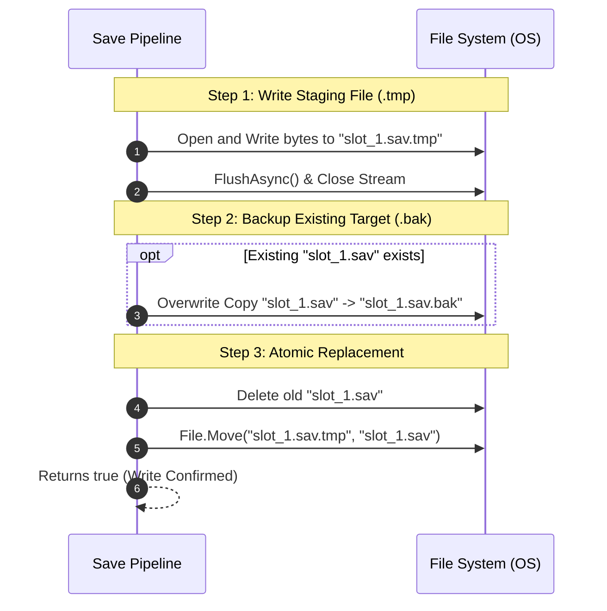

## 1. Physical Storage Architecture (`StorageEngine.cs`)

Disk I/O operations in video games are fraught with peril: power loss, battery exhaustion, OS-level application force-quits, or game engine crashes can occur at the exact millisecond a file is being flushed to persistent storage. A partially written file produces corrupted save state, rendering player progress unrecoverable.

FuzzySave eliminates this risk using an **Atomic Three-Way Swap Protocol** implemented in `LocalFileStorageProvider`.

### 1.1 The Atomic Swap Lifecycle



1. **Temporary Staging (`.tmp`):** The data payload is written to `filepath + ".tmp"`. If a power loss occurs at this stage, the original `slot_1.sav` remains completely untouched and valid.
2. **Backup Archiving (`.bak`):** If a previous valid save exists, it is duplicated to `filepath + ".bak"`.
3. **Atomic Swap (`File.Move`):** The operating system filesystem metadata pointer is updated. The temporary `.tmp` file is promoted to become the active `.sav` file.
4. **Exception Handling & Cleanup:** If any I/O exception occurs during the process, the `.tmp` staging file is purged, and the original save file is preserved without corruption.

### 1.2 Dual-Tier Reading & Fallback Recovery

When `ReadBytesAsync(path, fallbackToBackup = true)` is invoked:
1. FuzzySave attempts to read the primary file (`slot_1.sav`).
2. If the primary file is missing, empty (0 bytes), locked, or raises an I/O exception, the system automatically logs a diagnostic warning and falls back to reading `slot_1.sav.bak`.
3. This self-healing architecture prevents player data loss even in the event of hardware sector damage or external corruption.

---

## 2. Cryptographic Security Layer (`SecurityHandlers.cs`)

To protect single-player and competitive integrity from hex-editors, cheat engines, and memory-dump tools, FuzzySave provides an enterprise-grade security suite.

### 2.1 AES-256-CBC Encryption (`EncryptionHandler`)

FuzzySave utilizes the Advanced Encryption Standard (AES) with 256-bit symmetric keys in Cipher Block Chaining (CBC) mode.

* **Key & IV Derivation (PBKDF2):** Passwords are never used directly as raw cryptographic keys. Instead, FuzzySave employs standard `Rfc2898DeriveBytes` (PBKDF2) using:
  * **Hash Algorithm:** `SHA256`
  * **Iteration Count:** 1,000 iterations (balanced for sub-millisecond mobile derivation and brute-force resistance).
  * **Static Salt:** `FuzzySaveSalt_2026`
  * **Key Size:** 32 bytes (256 bits).
  * **IV Size:** 16 bytes (128 bits).
* **Zero-Allocation Key Cache:** Derived keys and IVs are cached in a thread-safe `ConcurrentDictionary<string, (byte[] Key, byte[] IV)>`, ensuring subsequent save calls do not re-derive cryptographic keys or cause Garbage Collection pressure.

```csharp
// Example: Manual encryption verification
byte[] rawData = Encoding.UTF8.GetBytes("Secret Player Inventory Data");
byte[] encrypted = EncryptionHandler.Encrypt(rawData, "MyCustomPassword_2026");
byte[] decrypted = EncryptionHandler.Decrypt(encrypted, "MyCustomPassword_2026");
```

### 2.2 Tamper Protection & Checksums (`ChecksumHandler`)

For games running competitive leaderboards, seasonal rewards, or anti-cheat policies, saves can be validated against an HMAC hash:
* **Algorithm:** HMAC-SHA256.
* **Constant-Time Verification:** `ValidateHMAC` checks each byte across the entire array rather than terminating on the first mismatch, guarding against side-channel timing attacks.

---

## 3. High-Ratio Data Compression (`CompressionHandler`)

Large open-world games can generate save files with tens of thousands of coordinates, quest states, and inventory objects. To minimize storage footprints and drastically speed up cloud sync transfers, FuzzySave integrates streaming compression.

* **Algorithm:** GZip (`System.IO.Compression.GZipStream`).
* **Compression Level:** `CompressionLevel.Optimal`.
* **Efficiency:** JSON payloads typically experience a **70% to 90% reduction** in physical file size. A 5 MB uncompressed world save reduces to approximately 600 KB, significantly decreasing disk write latency and network bandwidth usage.

---

## 4. Delta Saving & In-Memory Snapshots (Time-Travel)

### 4.1 Delta Save Hashing

When `enableDeltaSave` is enabled in `FuzzySaveSettings`:
* During `SaveAsync()`, FuzzySave computes and caches hash signatures of every serialized entry in `s_DeltaHashes`.
* Entries that have not changed since the last write cycle can be selectively skipped, minimizing disk wear on platforms with solid-state storage (such as mobile flash memory and consoles).

### 4.2 RAM Snapshots (Time-Travel / Checkpoint System)

FuzzySave features an in-memory snapshot mechanism that bypasses physical disk I/O entirely. This is ideal for:
* Replay systems.
* "Undo" / rewind gameplay mechanics.
* Instant trial-and-error checkpoints (e.g., before entering a boss battle).

```csharp
using FuzzyLogicLabs.FuzzySave;

// Take instant snapshot before entering dangerous area
FuzzySaveManager.TakeSnapshot("PreBossBattle");

// ... Player dies or fails puzzle ...

// Restore state instantaneously from RAM with zero disk hitch
FuzzySaveManager.RestoreSnapshot("PreBossBattle");
```

When a snapshot is restored:
1. Mapped field values are reapplied to live scene components.
2. Scene `SaveGuid` transforms and rigidbody velocities are reinstated.
3. Active dynamic spawned GameObjects are synchronized back to their exact snapshot positions and physics states.

---

## 5. Schema Versioning & Migrations (`SaveMigrationManager.cs`)

As live games receive patches, seasonal content, and architectural updates, save data models inevitably evolve. A variable named `playerGold` might become `currencyAmount`, or health values might be rebalanced from integers to floats.

FuzzySave includes an automated version migration engine that guarantees older save files cleanly upgrade to newer formats without data loss.

### 5.1 How the Migration Pipeline Works

1. Each `SaveContainer` stores a `saveVersion` integer (defaulting to 1).
2. When `LoadAsync()` is called, FuzzySave checks the loaded `saveVersion` against `FuzzySaveSettings.currentSaveVersion`.
3. If `container.saveVersion < currentSaveVersion`, FuzzySave evaluates registered migration steps and runs them sequentially.


### 5.2 Registering Custom Migrations

Migrations should be registered at game startup (e.g., inside a `[RuntimeInitializeOnLoadMethod]` or an initialization script):

```csharp
using UnityEngine;
using FuzzyLogicLabs.FuzzySave;

public static class GameSaveMigrations
{
    [RuntimeInitializeOnLoadMethod(RuntimeInitializeLoadType.BeforeSceneLoad)]
    private static void RegisterAllMigrations()
    {
        // Migration from Version 1 to Version 2:
        // Renamed 'gold' to 'coins' and added default 'gems'
        SaveMigrationManager.RegisterMigration(1, 2, container =>
        {
            var goldEntry = container.entries.Find(e => e.key == "gold");
            if (goldEntry != null)
            {
                goldEntry.key = "coins"; // Update key name
            }

            // Inject new default field for v2 players
            container.entries.Add(new SaveEntry
            {
                key = "gems",
                typeName = typeof(int).AssemblyQualifiedName,
                jsonValue = "10"
            });

            Debug.Log("[Migration] Successfully upgraded save container from v1 to v2!");
        });

        // Migration from Version 2 to Version 3:
        // Convert old string difficulty to integer enum ID
        SaveMigrationManager.RegisterMigration(2, 3, container =>
        {
            var diffEntry = container.entries.Find(e => e.key == "game_difficulty");
            if (diffEntry != null)
            {
                if (diffEntry.jsonValue.Contains("Hard")) diffEntry.jsonValue = "2";
                else if (diffEntry.jsonValue.Contains("Medium")) diffEntry.jsonValue = "1";
                else diffEntry.jsonValue = "0";
            }
        });
    }
}
```

If no explicit migration path exists for an intermediate version, FuzzySave logs a diagnostic warning and advances the version pointer to prevent infinite migration loops.
