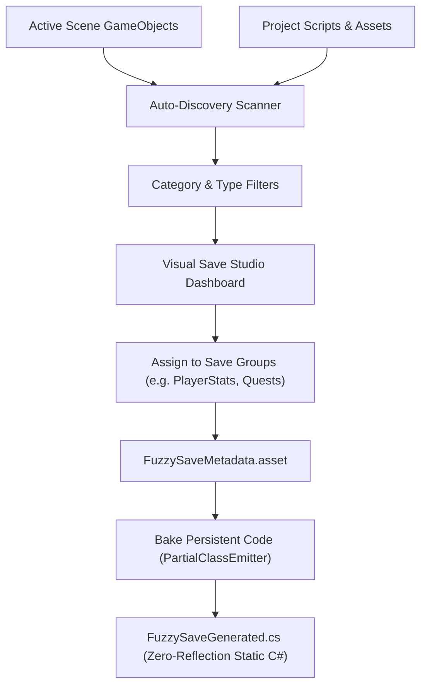

## 1. Overview & Launching the Studio

**Visual Save Studio** is a complete, UI Toolkit-powered visual authoring suite built into the Unity Editor. It enables developers, game designers, and technical artists to configure, inspect, debug, and bake save data systems without writing boilerplate code.

To open the window:
* Navigate to the top Unity menu: **`Tools > FuzzySave > Visual Save Studio`**
* Keyboard shortcut (optional): Can be bound via Unity's Shortcut Manager.

```
+-----------------------------------------------------------------------------------------+
|  [ Dashboard ]   [ Save Explorer ]   [ Events ]   [ Slots ]   [ Settings ]              |
+-----------------------------------------------------------------------------------------+
|                                                                                         |
|   Active View Content Area                                                              |
|   (Fully reactive UI Toolkit elements styled with custom USS stylesheets)               |
|                                                                                         |
+-----------------------------------------------------------------------------------------+
```

---

## 2. Dashboard Tab: Auto-Discovery & Code Baking

The **Dashboard** is the command center for mapping your game’s fields into logical **Save Groups**.



### 2.1 The Auto-Discovery Engine (`AutoDiscoveryEngine`)
The Dashboard features a recursive scanning engine that automatically detects savable data across your project:
* **Active Scene Scan:** Scans loaded scenes for `MonoBehaviour` scripts, public fields, private fields, and Unity Events.
* **Smart Blacklisting:** Automatically excludes Unity internal properties (`gameObject`, `transform`, `rigidbody`, `mesh`, `materials`, `hideFlags`, etc.) to keep the inspector clutter-free.
* **Category Tabs:**
  * **User Scripts:** Shows custom gameplay code authored by your team.
  * **Engine Components:** Displays standard Unity components if you need to track specific engine states.
  * **Save Map:** Provides a consolidated tree view of all currently mapped groups and their bound variables.
* **Filter Toggles:** Instant toolbar toggles to filter by:
  * **Primitives:** `int`, `float`, `bool`, `string`, `long`, `double`.
  * **Unity Events:** `UnityEvent`, custom delegates, and Action bindings.
  * **Custom Types:** Serializable custom classes and structs.
  * **ScriptableObjects:** Referenced data containers in the scene.

### 2.2 Save Groups Management
Save Groups allow you to separate different systems (e.g., `PlayerStats`, `Inventory`, `WorldState`, `Settings`) into independent serialization blocks:
* **Group Creation:** Enter a group name in the input box and click **Create Group**.
* **Mapping Fields:** Check the checkboxes next to discovered fields, or drag-and-drop fields directly into the desired Save Group card.
* **Field Aliasing:** Assign a clean custom key (e.g., map `m_InternalCurrentPlayerHealthPoints` to `player_hp`).
* **Group Overrides:** Configure individual groups to have custom encryption, compression, or auto-save interval settings distinct from global defaults.

### 2.3 Baking Persistent Code (`Bake Persistent Code`)
While reflection-based data gathering works in the editor, shipping games with heavy runtime reflection causes CPU frame spikes and Garbage Collection overhead.

Clicking **`Bake Persistent Code`** triggers the `PartialClassEmitter`:
1. Analyzes your `SaveMetadataSO` asset.
2. Emits an optimized, direct C# class to `Assets/FuzzyLogicLabs/FuzzySave/Runtime/Generated/FuzzySaveGenerated.cs`.
3. Replaces reflection with direct, strongly typed switch statements and cached component lookup tables (`FuzzySaveGeneratedBake`).
4. Result: **Sub-millisecond data collection** with **zero runtime reflection**.

---

## 3. Save Explorer Tab: Visual JSON Tree & Editor

The **Save Explorer** is an IDE-grade visual editor designed specifically for inspecting and modifying save files.

### 3.1 Key Features

* **JetBrains Mono Typography:** Crisp monospace code font loaded directly from `Resources/Fonts/JetBrainsMono-Regular.ttf`.
* **Hierarchical Tree & Raw Views:**
  * **Tree Mode:** Interactive, expandable nested visual nodes representing the JSON object graph.
  * **Raw Mode:** Formatted raw JSON text with line wrapping for manual editing or copy-pasting.
* **Live Search & Filter:** A real-time search field at the top immediately filters keys and values. Matching hierarchy branches automatically expand.
* **Visual Type Badges & Indicators:**
  * Blue `{ } (n props)` badge for JSON Objects.
  * Purple `[ ] (n items)` badge for JSON Arrays.
  * **Color Swatches:** If a node represents a color (`r`, `g`, `b`), Save Explorer renders an inline live colored rectangle reflecting the exact RGBA value.
  * **Vector Pills:** Objects containing `x`, `y`, `z` render a single-line summary pill: `(X: 1.25, Y: 0.00, Z: 5.40)`.
* **Inline Value Editing:**
  * **Booleans:** One-click toggle pills (`✔ true` / `✖ false`).
  * **Strings & Numbers:** Inline text inputs allowing instant edits without opening external editors.
* **Toolbar Actions:**
  * `⊞ Expand All`: Recursively opens all JSON trees.
  * `⊟ Collapse All`: Collapses the tree to root nodes.
  * `📋 Copy JSON`: Copies the formatted JSON payload to the system clipboard.
  * `💾 Save Changes`: Writes all modifications back to disk through the atomic storage pipeline.
* **Metadata Status Strip:** Displays slot name, physical file size (KB), serialization format, `🔒 Encrypted`, `📦 Compressed (GZip)`, and the exact last modification timestamp.

---

## 4. Events Tab: Declarative No-Code Save Triggers

The **Events** tab allows designers to establish automated save and load rules without writing a single line of C#.

Each rule is an instance of `SaveEventRule`:
* **Scope:** `Global` (affects the entire game state) or `GroupSpecific` (targets only a specific group, e.g., `Inventory`).
* **Trigger Conditions (When):**
  * `OnAwake`: Executes when game boots or scene initializes.
  * `OnStart`: Executes during MonoBehaviour `Start()`.
  * `OnSceneLoaded`: Triggers automatically when a new scene finishes loading.
  * `OnSceneUnloaded`: Triggers before leaving a level.
  * `OnApplicationPause`: Crucial for mobile (iOS/Android) when the player minimizes the app.
  * `OnApplicationQuit`: Triggers when the game window closes.
  * `PeriodicInterval`: Triggers every `N` seconds (e.g., auto-save every 180 seconds).
  * `OnCustomEvent`: Listens for custom string events fired via `FuzzySaveManager.TriggerEvent("BossDefeated")`.
* **Actions (Do):**
  * `SaveToSlot`
  * `LoadFromSlot`
  * `DeleteSlot`
  * `ClearAllSlots`

---

## 5. Slots Tab: Multi-Slot Organizer

The **Slots** tab provides a card-based visual browser for all save slots stored in the project's save directory:
* **Slot Cards:** Each slot is presented as a card displaying its slot name, file size (in KB/MB), date and time of last write, and an existence badge.
* **Actions Per Slot:**
  * **Create Slot:** Initializes a new named save slot file.
  * **Clone Slot:** Duplicates an existing slot into a new name (ideal for player branch saves or multiple playthrough profiles).
  * **Delete Slot:** Safely deletes the `.sav`, `.tmp`, and `.bak` files from disk.
  * **Clear All Slots:** Prompts a confirmation dialog and wipes all save slots from the local device.

---

## 6. Settings Tab: Global Engine Configuration

The **Settings** tab acts as the visual inspector for `FuzzySaveSettings`:

| Field Name | Type | Description |
|---|---|---|
| **Save Folder Name** | `string` | Directory name inside `Application.persistentDataPath` (default: `FuzzySaveData`). |
| **Default Format** | `Enum` | `Json` (human-readable) or `Binary` (compact). |
| **Enable Backup** | `bool` | Toggles automatic creation of `.bak` files during atomic writes. |
| **Current Save Version**| `int` | Current schema version number used by `SaveMigrationManager`. |
| **Enable Delta Save** | `bool` | Skips rewriting unchanged data blocks using hash verification. |
| **Enable Encryption** | `bool` | Activates AES-256 symmetric encryption on all slot saves. |
| **Encryption Password**| `string` | Secret passphrase used by PBKDF2 key derivation. |
| **Enable Compression** | `bool` | Enables GZip stream compression. |
| **Enable Cloud Sync** | `bool` | Activates background cloud upload/download synchronization. |
| **Cloud Provider** | `Enum` | `None`, `UnityCloudSave`, `SteamCloud`, `PlayFab`, `Firebase`, `REST`. |
| **Conflict Policy** | `Enum` | `UseNewest`, `AlwaysLocal`, `AlwaysCloud`. |
| **Registered Prefabs** | `List` | Prefab path registry for dynamic entity reconstruction at runtime. |
