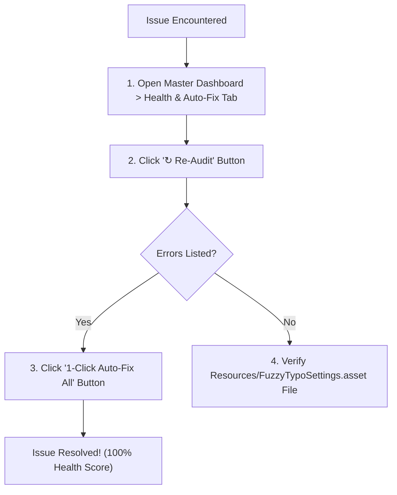

[← Previous: Runtime API & Scripting](/docs/fuzzytypo/runtime-api-and-scripting/) | [Main Overview](/docs/fuzzytypo/)

---

## Frequently Asked Questions (FAQ)

### 1. Why do certain characters render as empty boxes (`□`) or question marks?
* **Cause:** The active font asset does not contain the required glyphs (e.g., Turkish `ş, ğ, ı`, CJK Kanji/Kana, or mathematical/decorative symbols).
* **Solution:**  
  1. Open the **Health & Auto-Fix** tab in the Master Dashboard.
  2. Click **"1-Click Auto-Fix All Issues"**.
  3. The system scans installed OS fonts, synthesizes fallback assets (`FuzzyCJK SDF` or `FuzzySymbols SDF`), and registers them into your primary font's fallback table automatically.

---

### 2. If I rename a style (e.g., from "Heading 1" to "H1 / Main Title"), will scene or prefab references break?
* **Answer:** **No, absolutely not.**  
  FuzzyTypo uses an **immutable GUID identity architecture**. Style display names, categories, and descriptions can be freely renamed at any time without corrupting scene or prefab references.

---

### 3. Does FuzzyTypo impact runtime performance (FPS) or memory consumption?
* **Answer:** **No; in fact, it enhances performance.**
  * `FuzzyTypoLinker` components run zero `Update()` loops.
  * Theme and language events dispatch via lightweight static C# delegates with **zero garbage collection allocations (0 Bytes GC Alloc)**.
  * With **Bake & Strip (Pro)** enabled, release builds strip all linker scripts from scenes, baking values directly into `TMP_Text` components for zero overhead on target devices.

---

### 4. How do I import tokens from Figma or external design systems?
* **Answer:**  
  1. Navigate to the **Settings & Pro** tab in the Dashboard.
  2. Click **"Import JSON..."** in the Tokens Interoperability panel.
  3. Select your W3C DTCG or Tokens Studio exported JSON file to import tokens.

---

### 5. What if I want a button text to be red while keeping its font size driven by central tokens?
* **Answer:**  
  In the Inspector for that GameObject's `FuzzyTypoLinker`, check the **"Color"** box under **Local Overrides**. The color will remain isolated, while sizing and typography metrics continue to synchronize with central tokens.

---

## Troubleshooting Guide

| Observed Symptom | Probable Cause | Recommended Resolution |
| :--- | :--- | :--- |
| **"Unable to load FuzzyTypoSettings" error** | The settings file in `Resources` was moved or deleted. | Opening `Window > Fuzzy Logic Labs > FuzzyTypo > Master Dashboard` automatically regenerates the missing settings asset. |
| **Scene text elements do not update when editing styles** | `Auto Live Sync in Editor` may be disabled. | Open **Settings & Pro** or `Project Settings > FuzzyTypo` and confirm that Live Sync is set to `true`. |
| **Prefab variant modifications revert when reloading the scene** | Prefab serialization unrecorded. | FuzzyTypo invokes `PrefabUtility.RecordPrefabInstancePropertyModifications` automatically; ensure you save your scene (`Ctrl+S`). |
| **Atlas text appears blurry or soft** | Low sampling point size during TMP asset generation. | Re-generate the font asset using the TMP Font Asset Creator with a larger atlas resolution (e.g., `1024x1024` or `2048x2048`). |

---

## Pre-Release Quality Checklist

Complete these 5 verification steps before submitting your game build to distribution (Steam, App Store, Google Play, Consoles):

- [ ] **1. Health Audit:** Run the Linter across all scenes and verify a `100% Compliant` score.
- [ ] **2. Font Memory Audit:** In `Insights & Analytics`, remove unreferenced `[Unused]` font atlases to trim release package size.
- [ ] **3. Glyph Verification:** Run `Glyph Analyzer` against all supported shipping languages (e.g., German, Turkish, CJK).
- [ ] **4. Bake & Strip Mode:** If dynamic runtime theme switching is not needed, enable `Strip Linkers on Build` for zero runtime overhead.
- [ ] **5. Multilingual Testing:** Use the `FuzzyTypoRuntimeDemo` overlay to verify language switches without layout clipping.

---

[← Previous: Runtime API & Scripting](/docs/fuzzytypo/runtime-api-and-scripting/) | [Main Overview](/docs/fuzzytypo/)
