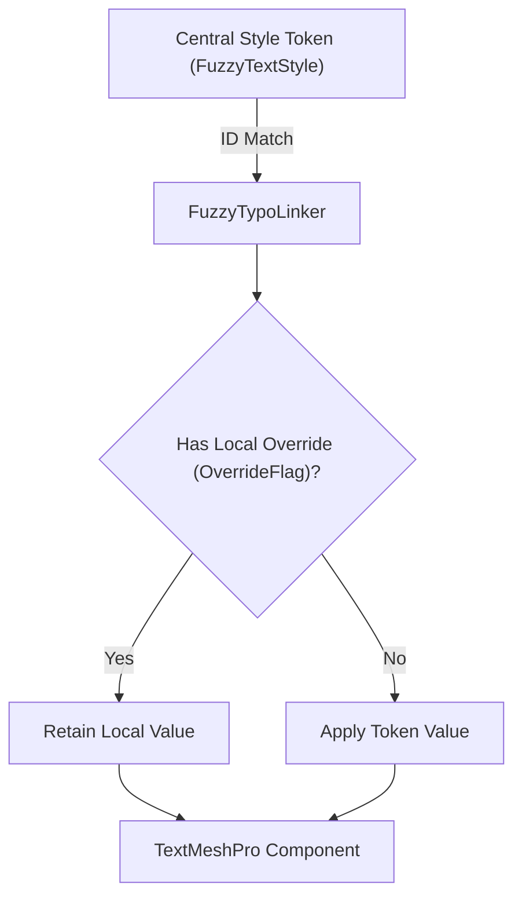

[← Previous: Core Concepts & Architecture](/docs/fuzzytypo/core-concepts-and-architecture/) | [Main Overview](/docs/fuzzytypo/) | [Next: Master Dashboard: Tokens Studio →](/docs/fuzzytypo/master-dashboard-tokens-studio/)

---

## What is FuzzyTypoLinker?

`FuzzyTypoLinker` is a lightweight `MonoBehaviour` bridge component attached to `TextMeshProUGUI` or 3D `TextMeshPro` GameObjects, connecting individual text components directly to centralized design tokens (`FuzzyTextStyle`).

```csharp
[ExecuteAlways]
[DisallowMultipleComponent]
[RequireComponent(typeof(TMP_Text))]
[AddComponentMenu("FuzzyTypo/Fuzzy Typo Linker")]
public class FuzzyTypoLinker : MonoBehaviour
{
    // Component Body
}
```



---

## Inspector Interface (FuzzyTypoLinkerEditor)

FuzzyTypoLinker features a custom Inspector built using Unity's modern **UI Toolkit** architecture.


### Inspector Elements:
1. **Connection Header & Status Badge:** Verifies which design system and theme profile the component is bound to.
2. **Style Dropdown Selector:** Lists all active theme styles categorized hierarchically (e.g., `Headings / Heading 1`, `Buttons / Button Label`).
3. **Master Dashboard Integration:** A one-click shortcut to launch the Master Dashboard and highlight the selected style for immediate editing.
4. **Local Overrides Section:** Checkboxes that designate which properties should remain independent of central tokens.

---

## 🎛️ Local Overrides & StyleOverrideFlags

Occasionally, a text instance must adhere to central typeface, font sizing, and alignment rules, but require an isolated property override—such as a specific red alert tint or unique character spacing.

FuzzyTypo achieves this through granular **Bitwise Enum Flags** (`StyleOverrideFlags`):

```csharp
[Flags]
public enum StyleOverrideFlags
{
    None             = 0,
    FontAsset        = 1 << 0,
    MaterialPreset   = 1 << 1,
    FontSize         = 1 << 2,
    AutoSizing       = 1 << 3,
    Color            = 1 << 4,
    Alignment        = 1 << 5,
    FontStyle        = 1 << 6,
    CharacterSpacing = 1 << 7,
    LineSpacing      = 1 << 8,
    WordSpacing      = 1 << 9,
    ParagraphSpacing = 1 << 10
}
```

### How It Works:
* If you toggle **"Color"** in the Local Overrides panel, changing themes or editing central style colors will leave this text's color untouched.
* All remaining unmarked properties (font asset, sizing, margins, line spacing) continue updating synchronously from the central design system.

---

## Lifecycle & Live Synchronization (Live Sync)

`FuzzyTypoLinker` is decorated with `[ExecuteAlways]`. Consequently:
1. **In Editor Mode (Live Sync):** Modifying a style's parameters in the Dashboard propagates to all open scene instances in real time.
2. **In Play Mode / Runtime:** The component binds to `FuzzyTypoManager` broadcast events during `OnEnable` and applies current theme states.
3. **Zero Memory Leaks:** Unregisters all event subscriptions cleanly during `OnDisable` (`-=`).

---

## Prefab Safety & Undo/Redo

All editor modifications integrate fully with Unity's `Undo` and `PrefabUtility` subsystems:

* Reverting a style change is as straightforward as pressing `Ctrl+Z` (macOS: `Cmd+Z`).
* Style assignments and local overrides configured on Prefab Variants remain strictly serialized when scenes are reloaded or updated across branches.

---

## Scripting API (C# Linker Control)

Controlling `FuzzyTypoLinker` instances programmatically is straightforward:

```csharp
using UnityEngine;
using TMPro;
using FuzzyLogicLabs.FuzzyTypo;

public class UIStyleModifier : MonoBehaviour
{
    [SerializeField] private FuzzyTypoLinker m_Linker;

    private void Start()
    {
        if (m_Linker == null)
            m_Linker = GetComponent<FuzzyTypoLinker>();

        // 1. Assign a new style dynamically
        // (Supply a GUID directly or look up by name from active theme)
        FuzzyTextStyle buttonStyle = FuzzyTypoManager.ActiveTheme.GetStyleByName("Button Label");
        if (buttonStyle != null)
        {
            m_Linker.StyleId = buttonStyle.Id;
        }

        // 2. Set an isolated local override
        m_Linker.SetOverride(StyleOverrideFlags.Color, true);
        m_Linker.TextComponent.color = Color.red;

        // 3. Force re-application of style parameters
        m_Linker.ApplyStyle();
    }
}
```

---

[← Previous: Core Concepts & Architecture](/docs/fuzzytypo/core-concepts-and-architecture/) | [Main Overview](/docs/fuzzytypo/) | [Next: Master Dashboard: Tokens Studio →](/docs/fuzzytypo/master-dashboard-tokens-studio/)
