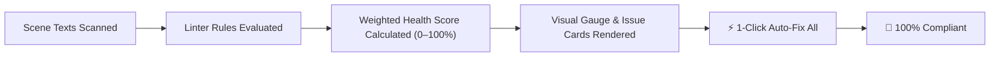

[← Previous: Master Dashboard: Scene Governance](/docs/fuzzytypo/master-dashboard-scene-governance/) | [Main Overview](/docs/fuzzytypo/) | [Next: Master Dashboard: Insights & Analytics →](/docs/fuzzytypo/insights-and-analytics/)

---

## What is Health & Auto-Fix Studio?

As game projects expand, text elements added by different team members often diverge from the established design system:
* Buttons use unapproved typefaces,
* Strings containing special characters, Turkish diacritics, or CJK glyphs render as missing squares (`□` or `?`),
* Dozens of text components remain unlinked from the central typography pipeline.

**Health & Auto-Fix Studio** addresses this by continuously auditing your scenes (`FuzzyTypographyLinter`), computing an objective **Design System Health Score (0% – 100%)**, and resolving detected discrepancies with a **1-Click Auto-Fix All** automated engine.

---

## Design System Health Score Gauge

Located at the top of the tab, the **Hero Health Card** displays your typography compliance level via a visual progress meter:

* **100% (Green — Compliant):** All scene text elements are linked to the design system, fonts are assigned correctly, and no missing glyphs exist.
* **70% – 99% (Yellow — Warnings):** Some text elements are unlinked or contain isolated local overrides.
* **0% – 69% (Red — Errors):** Critical missing font assets or unmapped glyphs that will appear broken in build releases.

---

## Evaluated Issue Types & Severity Levels

`FuzzyTypographyLinter` validates text instances across 5 core criteria:

| Issue Type (`IssueType`) | Severity | Score Impact | Description |
| :--- | :--- | :--- | :--- |
| **MissingFontAsset** | `Error` | High | The text component has no font asset assigned (`None`). Renders pink or broken in-game. |
| **MissingGlyphs** | `Error` | High | Characters in the text string (e.g., diacritics `ç, ğ, ş`, CJK ideographs, symbols) are absent from font atlases and fallbacks. Renders as `□`. |
| **UnlinkedText** | `Warning` | Medium | The text has no `FuzzyTypoLinker` attached and does not respond to central theme updates. |
| **OffScaleFontSize** | `Warning` | Medium | The font size (e.g., `17.3px`) matches none of the modular type scale tokens defined in the active theme. |
| **LocalOverrides** | `Info` | Low | The text is linked to a central style, but specific properties (such as color) have been overridden locally. |

---

## 1-Click Auto-Fix All Engine

Resolving hundreds of minor discrepancies by hand is tedious. The prominent green **"1-Click Auto-Fix All Issues"** button handles this automatically:

### What happens when clicking 1-Click Auto-Fix?
1. **Missing Fonts Are Restored:** Unassigned text components receive the active theme's primary font asset.
2. **Unlinked Texts Are Bound:** Components are analyzed by font size and context role, then automatically linked to the best-matching `FuzzyTextStyle`.
3. **Missing Glyphs Are Resolved (`FuzzyGlyphFixer`):** Operating system fonts (`Yu Gothic`, `Segoe UI Symbol`, etc.) are queried to synthesize fallback font assets, which are immediately chained into the primary font's fallback list.
4. **Invalid Overrides Are Cleaned:** Redundant or invalid overrides are normalized.
5. **Result:** Your scene achieves a **100% Health Score** within seconds!

> [!NOTE]
> All automated modifications are registered into Unity's `Undo` history. If desired, any operation can be immediately undone using `Ctrl+Z` (macOS: `Cmd+Z`).

---

## Individual Issue Card UI

Every detected discrepancy is presented as an actionable card:
* **Title & Hierarchy Path:** Precise scene route (`Canvas > Panel > TitleText`).
* **Description:** Technical explanation and specific missing Unicode values (e.g., `U+011F (ğ)`).
* **Ping Button:** Highlights the GameObject in the scene view and hierarchy (`EditorGUIUtility.PingObject`).
* **Suggested Action Button:** Resolves the issue for that specific object (e.g., *"Link to 'Heading 1'"* or *"Add Fallback Font"*).

---

[← Previous: Master Dashboard: Scene Governance](/docs/fuzzytypo/master-dashboard-scene-governance/) | [Main Overview](/docs/fuzzytypo/) | [Next: Master Dashboard: Insights & Analytics →](/docs/fuzzytypo/insights-and-analytics/)
