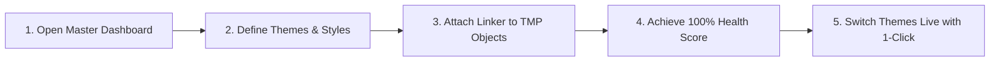

> **Central Typography & Design Tokens Management Suite for Unity**  
> *Version:* `1.0.0` | *Developer:* **Fuzzy Logic Labs** | *Platform:* Unity 2021.3 LTS, 2022.3 LTS, 2023.2, and Unity 6+ (Unity 6000.x)  
> *Support & Inquiries:* [devbayk@gmail.com](mailto:devbayk@gmail.com) | [Discord Community](https://discord.gg/CGpunqn49e) | [Official Website](https://fatihbykl.github.io/docs/fuzzytypo/)

---

## Documentation Table of Contents

This documentation walks through every component, editor suite, runtime API, and advanced optimization mechanism provided by **FuzzyTypo**:

| Chapter | Topic | Description |
| :--- | :--- | :--- |
| **[01. Introduction & Setup](/docs/fuzzytypo/introduction-and-setup/)** | Getting Started & Configuration | System requirements, package installation, Welcome window, and Project Settings. |
| **[02. Core Concepts & Architecture](/docs/fuzzytypo/core-concepts-and-architecture/)** | Architectural Principles | Design Tokens architecture, `FuzzyTheme`, `FuzzyTextStyle`, immutable GUID mapping, and Zero-GC vision. |
| **[03. FuzzyTypoLinker Component](/docs/fuzzytypo/fuzzytypo-linker/)** | Text Bridge | `FuzzyTypoLinker` lifecycle, Inspector UI, Live Sync, Local Override flags, and prefab safety. |
| **[04. Master Dashboard: Tokens Studio](/docs/fuzzytypo/master-dashboard-tokens-studio/)** | Tab 1: Style Design | Theme management, Style Inspector, Modular Type Scale Generator, Live Preview Canvas, and Usage Explorer. |
| **[05. Master Dashboard: Scene Governance](/docs/fuzzytypo/master-dashboard-scene-governance/)** | Tab 2: Scene Auditing | Scene/Prefab scanning, Hierarchical UI Context Roles detection, Multi-selection, Smart Auto-Link, and Pagination. |
| **[06. Master Dashboard: Health & Auto-Fix](/docs/fuzzytypo/health-and-autofix-studio/)** | Tab 3: Linter & Repair | `FuzzyTypographyLinter`, Health Score Gauge (0–100%), Issue and Warning analysis, 1-Click Auto-Fix All engine. |
| **[07. Master Dashboard: Insights & Analytics](/docs/fuzzytypo/insights-and-analytics/)** | Tab 4: Analytics & Assets | `FuzzyFontAnalytics` (Atlas memory weight & dimensions), `FuzzyPrefabAnalytics` (Coverage matrix), and Safe Font Replacer. |
| **[08. Master Dashboard: Settings & Pro](/docs/fuzzytypo/settings-and-pro-features/)** | Tab 5: Pro & Optimization | JSON Token Interoperability (Figma / W3C DTCG Format), Bake & Strip build optimization, and Demo Scene Generator. |
| **[09. Multilingual Typography & Localization](/docs/fuzzytypo/localization-and-multilingual/)** | Global Language Support | `LocaleOverride`, `FuzzyLocalizationProfile`, and automatic CJK & Symbol fallback generation with `FuzzyGlyphFixer`. |
| **[10. Standalone Editor Tools](/docs/fuzzytypo/standalone-tools/)** | Auxiliary Editor Utilities | Auto-Migrator (legacy TMP migration), Glyph Analyzer (character set verification), and Batch Material Swapper. |
| **[11. Runtime API & Scripting](/docs/fuzzytypo/runtime-api-and-scripting/)** | Runtime API Guide | `FuzzyTypoManager` events/methods, runtime theme & language switching, Zero-GC principles, and Runtime Demo HUD. |
| **[12. FAQ & Troubleshooting](/docs/fuzzytypo/faq-and-troubleshooting/)** | Problem Solving & Tips | Common scenarios, font atlas artifacts, performance optimization, and best practices. |

---

## Quick Start (FuzzyTypo in 5 Minutes)

Getting started with FuzzyTypo in your project takes only a few quick steps:

### 1. Open the Master Dashboard
In the Unity top menu, navigate to **Window > Fuzzy Logic Labs > FuzzyTypo > Master Dashboard**, or use the shortcut `Ctrl+Shift+T` (macOS: `Cmd+Shift+T`).

### 2. Generate Starter Themes (Optional)
Head over to the **Settings & Pro** tab in the Dashboard and click **"Generate Starter Themes"**. Within seconds, modern `SampleDarkTheme` and `SampleLightTheme` assets will be generated and registered into your project.

### 3. Connect Your Text Objects
Select any `TextMeshProUGUI` or `TextMeshPro` GameObject in your Hierarchy, click **Add Component > Fuzzy Typo Linker**, and pick a style from the dropdown menu (e.g., `Headings / H1 Hero Display`).

### 4. Observe Live Synchronization
Modify the font size, color, or line spacing of the style directly from the Dashboard, and watch all connected text objects in your scene update instantly in real time!

---

## Key Capabilities & Highlights

* **Centralized Design Tokens:** Update headline, body, button, and numeric telemetry typography styles across your entire game project with a single click.
* **Zero GC Allocations:** Does not run an `Update()` loop at runtime. Operates purely on an event-driven basis with zero garbage collection overhead.
* **Modern UI Toolkit Dashboard:** Fully aligned with Unity 6 and modern editor interface standards, offering a responsive dark-themed workspace.
* **1-Click Auto-Fix & Linter:** Detects untracked fonts, unlinked text elements, and missing glyphs across your scenes, elevating your design system health score to 100% in a single click.
* **Smart Fallback & Automatic CJK Generation:** Automatically generates TMP SDF fallback fonts from operating system typefaces for Japanese, Chinese, Korean, or custom symbols, chaining them seamlessly.
* **Bake & Strip Pro Optimization:** Permanently bakes resolved typography values into `TMP_Text` components and strips linker scripts during Release builds for zero overhead on end-user devices.
* **Figma & JSON Interoperability:** Exchange design tokens with design teams using standard W3C DTCG JSON format.

---

> [!TIP]
> To begin exploring and configuring your project, continue to **[01. Introduction & Setup](/docs/fuzzytypo/introduction-and-setup/)**.
