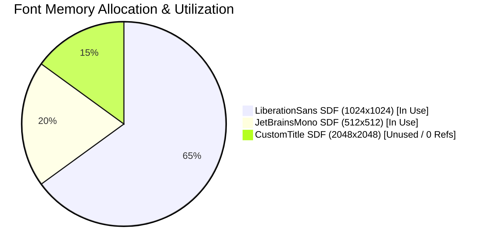
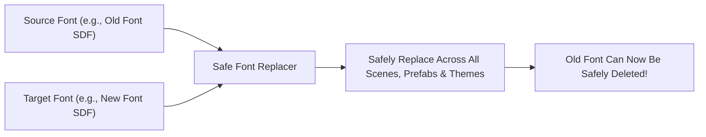

[← Previous: Master Dashboard: Health & Auto-Fix](/docs/fuzzytypo/health-and-autofix-studio/) | [Main Overview](/docs/fuzzytypo/) | [Next: Master Dashboard: Settings & Pro →](/docs/fuzzytypo/settings-and-pro-features/)

---

## What is Insights & Analytics Studio?

In production game projects, typefaces (`TMP_FontAsset`) and their corresponding signed distance field textures (SDF Texture Atlases) represent some of the heaviest UI assets in terms of **RAM/VRAM consumption and build footprint**. Inadvertently including two unused 2048x2048 font atlases can cause mobile titles to exceed memory budgets.

**Insights & Analytics Studio** audits your typography footprint across the entire repository, breaking down memory weights and mapping typography coverage on a per-prefab basis.

---

## 1. Font Asset Memory Weight & Footprint Analysis (FuzzyFontAnalytics)

The left column indexes all `TMP_FontAsset` instances detected in your project and summarizes their footprint:

### Tracked Metrics:
* **Atlas Dimensions & VRAM Footprint:** e.g., `1024x1024 (1.0 MB)` or `2048x2048 (4.0 MB)`.
* **Scene and Prefab Reference Count:** Tracks how many scene text components, prefab assets, and theme styles reference each font asset.
* **Unused Font Detection (`Unused` Badge):** Highlights fonts present on disk that have zero references across scenes, prefabs, and themes. Removing these unused assets instantly reclaims megabytes from your package build size.
* **Rarely Used Warnings:** Pinpoints single-instance special fonts that may be candidates for consolidation.

---

## 2. Prefab Typography Coverage Matrix (FuzzyPrefabAnalytics)

The right column itemizes every UI prefab in the project and displays its design system adoption level (`Coverage %`):

### Matrix Insights:
* **Coverage Badge:** e.g., `8/10 (80%)`, signifying that 8 out of 10 text instances inside the prefab are connected to central tokens.
* **Scene Instance Count:** Indicates how many active instances of this prefab exist in the open scene (`In Scene: 5`).
* **Referenced Fonts:** Lists the specific font assets required by the prefab.
* **One-Click Prefab Access:** Clicking the prefab name opens it in the Unity Project window or launches Prefab Isolation Mode.

---

## 3. Safe Font Replacer

Deleting or renaming a font asset in Unity conventionally leaves hundreds of text components with missing reference warnings (`None (TMP_FontAsset)`).

The **Safe Font Replacer** utility accessible from the toolbar eliminates this danger:

### How to Use:
1. **Source Font:** Select the obsolete font asset you wish to replace.
2. **Target Font:** Choose the replacement font asset.
3. **Execute Replace:** Click the button to scan all scenes, prefabs, and `FuzzyTheme` assets, remapping every reference safely.
4. You can now delete the old font asset from your project without breaking any UI assets.

---

## 4. UI Context Role Distribution

At the bottom of the window, a horizontal distribution meter illustrates how typography is apportioned across different UI archetypes:

* Compares relative proportions between Buttons, Input Fields, Headings, and General Text, providing a high-level view of interface balance.

---

[← Previous: Master Dashboard: Health & Auto-Fix](/docs/fuzzytypo/health-and-autofix-studio/) | [Main Overview](/docs/fuzzytypo/) | [Next: Master Dashboard: Settings & Pro →](/docs/fuzzytypo/settings-and-pro-features/)
