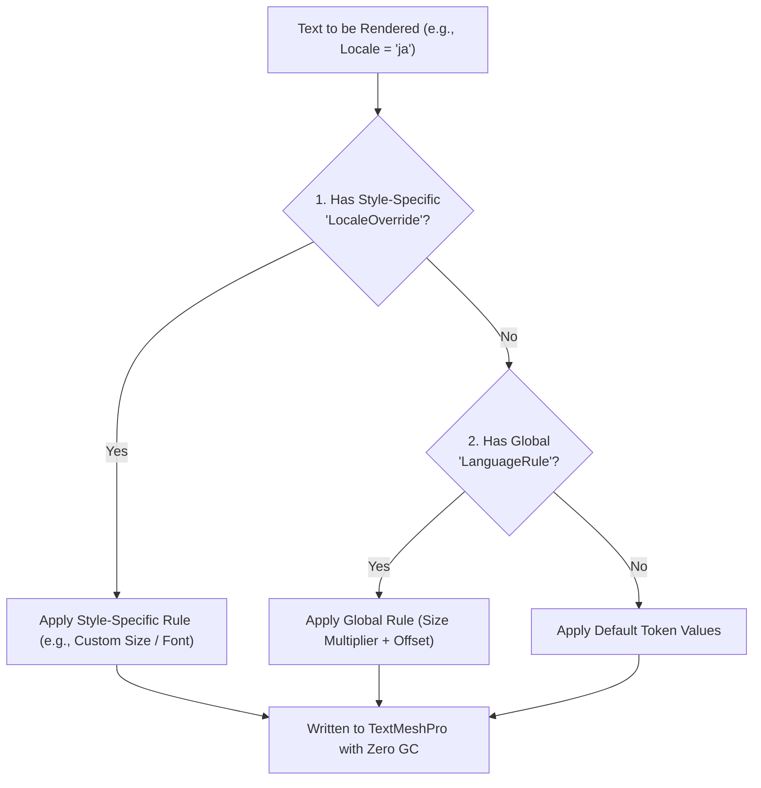

[← Previous: Master Dashboard: Settings & Pro](/docs/fuzzytypo/settings-and-pro-features/) | [Main Overview](/docs/fuzzytypo/) | [Next: Standalone Editor Tools →](/docs/fuzzytypo/standalone-tools/)

---

## Multilingual Typography Challenges in Games

When launching games globally, typography becomes a complex engineering challenge:
* **CJK Languages (Japanese, Chinese, Korean):** Standard Latin font assets contain no CJK glyphs, leading to missing character boxes (`□`) or question marks. Furthermore, because CJK characters are denser and vertically larger than Latin glyphs, they frequently require an `85%–90%` font size scaling and enlarged line heights to avoid UI overflow.
* **German:** Long compound nouns frequently cause horizontal button and label clipping.
* **Arabic:** Requires right-to-left (RTL) reading flow and distinctive glyph shaping.
* **Turkish:** Characters with delicate dot distinctions (`İ / i`, `I / ı`) and diacritics (`ş, ğ, ç`) are frequently absent from western font packs.

**FuzzyTypo** addresses these realities with a robust **Two-Tier** localization architecture.

---

## Two-Tier Resolution Architecture



---

## 1. Tier 1: Global Language Rules (FuzzyLocalizationProfile)

`FuzzyLocalizationProfile` is a project-wide `ScriptableObject` containing global typography transformation rules (`LanguageRule`):


```csharp
[Serializable]
public class LanguageRule
{
    public string LocaleCode;              // e.g., "ja", "tr", "de", "ar"
    public string DisplayName;             // e.g., "Japanese"
    public TMP_FontAsset DefaultFontAsset; // Font asset swapped in for this language
    public Material DefaultMaterialPreset;
    public float FontSizeMultiplier;       // e.g., 0.90f (Scale down by 10%)
    public float LineSpacingOffset;        // e.g., +4f (Expand line height)
    public float CharacterSpacingOffset;
}
```

* For instance, if Japanese (`ja`) defines `FontSizeMultiplier = 0.9` and `LineSpacingOffset = 3`, switching the game to Japanese automatically rescales hundreds of dialogue, button, and HUD elements across the project to prevent container overflows.

---

## 2. Tier 2: Style-Specific Overrides (LocaleOverride)

If a specific headline token (`H1 Hero`) requires a custom typeface or distinct font size when rendered in Japanese, you can attach a **LocaleOverride** directly to that token:

* **Override Font Asset:** Designates a dedicated typeface for the chosen culture.
* **Font Sizing Strategy:** Specify either a relative multiplier (e.g., `0.85x`) or an absolute fixed point size (e.g., `32px`).
* **Spacing & Alignment Overrides:** Adapt character tracking and margins for language nuances.

---

## Automatic Fallback & CJK Glyph Fixer (FuzzyGlyphFixer)

One of FuzzyTypo's hallmark innovations is the built-in **`FuzzyGlyphFixer`** engine.

When the Linter detects characters not present in your primary font atlas (e.g., Japanese Kana `あ, い, う` or symbols `★, ⚔, 🛡`):
1. No manual font creation or atlas baking is required.
2. `FuzzyGlyphFixer` inspects your operating system's installed fonts (e.g., `Yu Gothic UI`, `Segoe UI Symbol` on Windows; `Hiragino Sans`, `Apple Symbols` on macOS).
3. In the background, it generates dedicated SDF fallback assets under `Assets/FuzzyLogicLabs/FuzzyTypo/Editor/Fonts/`:
   * `FuzzyCJK SDF.asset`
   * `FuzzySymbols SDF.asset`
   * `FuzzyFallback SDF.asset`
4. It chains these synthesized assets directly into your primary font's **Fallback Font Asset Table (`fallbackFontAssetTable`)**.
5. Your game renders clean, legible glyphs with zero missing character boxes (`□`).

---

## Runtime Language Switching (API Usage)

Switching active languages during gameplay from your settings menu is handled via `FuzzyLocalizationManager` or `FuzzyTypoManager`:

```csharp
using UnityEngine;
using FuzzyLogicLabs.FuzzyTypo;

public class LanguageSelector : MonoBehaviour
{
    // 1. Switch by ISO Language Code
    public void SelectJapanese()
    {
        FuzzyLocalizationManager.SetLocale("ja");
    }

    public void SelectTurkish()
    {
        FuzzyLocalizationManager.SetLocale("tr");
    }

    // 2. Switch by Unity SystemLanguage Enum
    public void SelectGerman()
    {
        FuzzyLocalizationManager.SetLanguage(SystemLanguage.German);
    }

    // 3. Auto-detect Operating System Culture
    public void AutoDetectDeviceLanguage()
    {
        FuzzyLocalizationManager.SyncWithSystemLanguage();
    }
}
```

> [!NOTE]
> Triggering language changes broadcasts the `FuzzyTypoManager.OnLocaleChanged` event. All active `FuzzyTypoLinker` instances update their parameters with **zero heap allocation (0 bytes GC Alloc)**.

---

[← Previous: Master Dashboard: Settings & Pro](/docs/fuzzytypo/settings-and-pro-features/) | [Main Overview](/docs/fuzzytypo/) | [Next: Standalone Editor Tools →](/docs/fuzzytypo/standalone-tools/)
