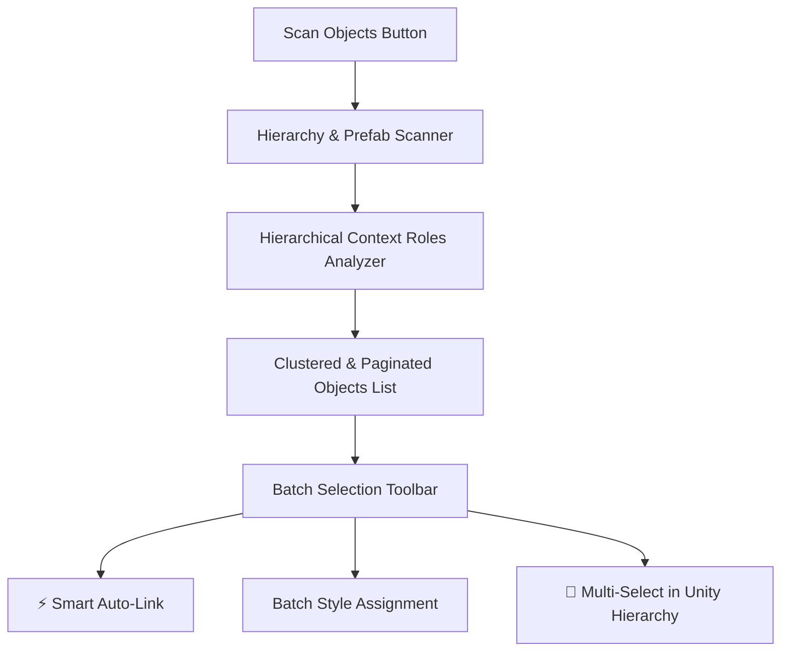

[← Previous: Master Dashboard: Tokens Studio](/docs/fuzzytypo/master-dashboard-tokens-studio/) | [Main Overview](/docs/fuzzytypo/) | [Next: Master Dashboard: Health & Auto-Fix →](/docs/fuzzytypo/health-and-autofix-studio/)

---

## Tab 2: Scene & Prefab Governance Manager

The second tab of the Master Dashboard, **Scene Governance**, indexes and clusters every `TMP_Text` component across your open scene or project prefabs, providing **bulk governance** and auditing capabilities.

---

## Scanning Scope & Filtering Controls

The top control panel defines audit depth and filtering criteria:

* **Audit Scope:**
  * `Active Scene`: Scans text components strictly within the active loaded scene.
  * `Selected Hierarchy`: Scans descendants of a selected GameObject (e.g., a specific parent Canvas or UI panel).
  * `Project Prefabs`: Scans all UI prefab assets stored on disk.
* **Facet Filter Chips:**  
  Filter by categorical states with one click: `All`, `Unlinked` (not bound to FuzzyTypo), `Linked` (bound), `Buttons`, `Inputs`, etc.
* **Search Field:** Fast instantaneous search by GameObject name, text content snippet, or assigned typeface.

---

## Hierarchical Context Roles Detection

Rather than acting as a simple flat text scanner, FuzzyTypo leverages the `FuzzyHierarchyContextUtility` engine.

By evaluating up to 4 ancestral parent levels in the Unity hierarchy, FuzzyTypo automatically identifies what UI component role the text belongs to:

| Detected Role | Badge | Parent Component Identified |
| :--- | :--- | :--- |
| **Button** | `[Button]` | `UnityEngine.UI.Button` |
| **InputField** | `[InputField]` | `TMP_InputField` or `UnityEngine.UI.InputField` |
| **Toggle** | `[Toggle]` | `UnityEngine.UI.Toggle` |
| **Dropdown** | `[Dropdown]` | `TMP_Dropdown` or `UnityEngine.UI.Dropdown` |
| **Slider** | `[Slider]` | `UnityEngine.UI.Slider` |
| **ScrollRect** | `[ScrollRect]` | `UnityEngine.UI.ScrollRect` |
| **Generic** | `[Generic]` | Independent text label or dialogue string |

---

## Smart Auto-Link

One of Scene Governance's most powerful productivity features is the **Smart Auto-Link** engine:

1. Identifies all **Unlinked** text instances in the scanned scope.
2. Evaluates the text's detected context role (`Button`, `InputField`, etc.) alongside its current font size.
3. Automatically maps the most appropriate `FuzzyTextStyle` token from the active theme.
4. Attaches a `FuzzyTypoLinker` and applies the style in a single batch operation.

> [!TIP]
> For instance, a text element with a font size of 16 situated inside a `Button` parent is automatically matched with the `Buttons / Button Label` token. Complex multi-screen UI projects can be fully onboarded into your design system in seconds!

---

## Power Multi-Selection Toolbar

Select individual items using row checkboxes, or take advantage of fast selection shortcuts:

* **Selection Shortcuts:**
  * `All`: Selects all filtered items.
  * `Unlinked`: Selects only unlinked items with one click.
  * `None`: Clears current selection.
  * `Invert`: Inverts the selection mask.
* **Batch Operations:**
  * **Assign Dropdown:** Assigns a specified style token to all selected objects simultaneously.
  * **Unlink Button:** Safely removes `FuzzyTypoLinker` components from selected GameObjects.
  * **🎯 Hierarchy Button:** Selects all matching GameObjects directly within Unity's native Hierarchy window.

---

## High-Performance Pagination Engine

In large RPG, MMO, or simulation projects containing thousands of text elements, rendering all items in a single list could cause editor interface hitching.

FuzzyTypo includes a built-in **pagination engine (`scene-pagination-bar`)**:
* Items Per Page: Display `25`, `50`, `100`, or `All` entries.
* Fast Navigation: `◀ Prev` and `Next ▶` controls.
* Memory Efficient: Only items on the active page are rendered, preserving a silky-smooth 60+ FPS editor experience.

---

## Integrated Material Swapper Drawer

Clicking the **🎨 Material Swapper** button in the toolbar opens a sliding utility drawer:

* Filter by specific typeface (e.g., `LiberationSans SDF`).
* Pick a target Material Preset (e.g., `Gold Outline Glow Material`) and click **Execute Swap** to rebind materials across all matched text instances at once.

---

[← Previous: Master Dashboard: Tokens Studio](/docs/fuzzytypo/master-dashboard-tokens-studio/) | [Main Overview](/docs/fuzzytypo/) | [Next: Master Dashboard: Health & Auto-Fix →](/docs/fuzzytypo/health-and-autofix-studio/)
