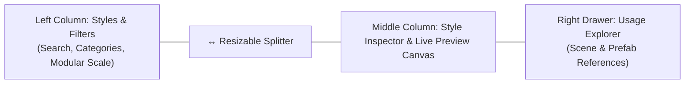

[← Previous: FuzzyTypoLinker Component](/docs/fuzzytypo/fuzzytypo-linker/) | [Main Overview](/docs/fuzzytypo/) | [Next: Master Dashboard: Scene Governance →](/docs/fuzzytypo/master-dashboard-scene-governance/)

---

## Master Dashboard Overview

The **Master Dashboard (FuzzyTypo Studio)** is an advanced UI Toolkit control workspace that empowers developers and technical UI designers to manage project-wide typographic styles, themes, scene bindings, and font analytics from one unified hub.

To open the window:  
**Window > Fuzzy Logic Labs > FuzzyTypo > Master Dashboard**

### Top Toolbar Elements:
* **Health Score Badge:** Displays the real-time typographic compliance score for your active scene (e.g., `Health: 100%`). Clicking it jumps directly to the Health & Auto-Fix Studio tab.
* **Theme Selector Dropdown:** Instantly switches between registered themes in the project.
* **+ New Theme Button:** Creates a new `FuzzyTheme` ScriptableObject asset with one click.
* **••• Theme Context Menu:** Provides operations to Duplicate, Delete, Export, or Import themes via JSON.
* **Locale Selector Dropdown:** Simulates font swapping and sizing behavior for different languages (e.g., `ja`, `tr`, `en`) live inside the editor.
* **↻ Refresh Button:** Synchronizes all style assets and scene references.

---

## Tab 1: Tokens Studio (Design Tokens Studio)

Tokens Studio features a responsive, 3-column modular layout:

---

## 1. Left Column: Styles and Filters

* **Search Field:** Fast instantaneous filtering by style name or category.
* **Dynamic Category Chips:** Automatically generated filter tags based on your theme's styles (`All`, `Headings`, `Body`, `Buttons`, `Display`, `Badges`).
* **+ Add Button:** Appends a new `FuzzyTextStyle` token to the currently selected category.
* **↔ Resizable Splitter:** Drag horizontally with your mouse to resize the left pane. Double-clicking resets the width to its default value (`270px`).

---

## 2. Modular Type Scale Generator

In typography, establishing visual hierarchy based on musical or mathematical ratios rather than arbitrary numbers is a foundational design principle.

Clicking the **⚡ Scale** button in the left column launches the Modular Type Scale wizard:

### Supported Scale Ratios (`TypeScaleRatio`):

| Ratio Name | Factor | Typical Application |
| :--- | :--- | :--- |
| **Minor Second** | `1.067` | Dense data tables and compact mobile inventory panels. |
| **Major Second** | `1.125` | Compact screens, mobile RPG inventory and stat readouts. |
| **Minor Third** | `1.200` | Standard mobile and tablet touch interfaces. |
| **Major Third** | `1.250` | **(Recommended)** Ideal desktop and console game UI balance. |
| **Perfect Fourth** | `1.333` | Clear, prominent heading-to-body contrast. |
| **Augmented Fourth** | `1.414` | Striking, bold title treatments. |
| **Perfect Fifth** | `1.500` | Cinematic titles and large display headlines. |
| **Golden Ratio** | `1.618` | Classic harmonic proportion with dramatic contrast. |

> [!TIP]
> Selecting a base size (e.g., `16px`) and scale ratio automatically calculates and populates **Display, Heading 1–4, Body Large/Regular/Small, Button Label, and Caption** tokens in perfect mathematical proportion.

---

## 3. Middle Column: Style Inspector & Live Preview Canvas

### Live Typographic Preview Canvas:
* **Live Rendering:** Visualizes font, size, color, spacing, and alignment settings immediately in the preview sandbox.
* **◐ Theme Background Toggle:** Alternates between light and dark backgrounds to evaluate contrast ratios.
* **Custom Text Input:** Allows testing arbitrary custom strings, localized terms, and character glyphs.
* **▲ Collapse Toggle:** Folds the preview canvas when more vertical space is needed for property inputs.

### Style Parameters Form:
1. **Identity & Metadata:** Style name, category, and designer documentation notes.
2. **Font & Material:** `TMP_FontAsset` selection and associated `Material Preset`.
3. **Sizing:** Standard point size or `Enable Auto-Sizing` (with minimum and maximum boundaries).
4. **Color & Styling:** RGBA color picker, Bold, Italic, Underline, Uppercase, and lowercase transform toggles.
5. **Alignment & Metrics:** Character spacing, line spacing, paragraph spacing, and word spacing sliders.
6. **Localization Overrides:** Culture-specific font remapping and size multipliers (see [Chapter 09](/docs/fuzzytypo/localization-and-multilingual/)).

---

## 4. Right Drawer: Usage Explorer

Clicking the **👁 Usages** button in the top right of the middle column expands an animated reference inspection drawer.

### Usage Explorer Capabilities:
* **Comprehensive Tracking:** Scans the active scene and all project prefabs to report how many times the selected style is referenced.
* **One-Click Object Focus (`PingObject`):** Clicking any item in the list immediately highlights and selects the corresponding GameObject in the Unity Hierarchy or Project window.
* **Unused Token Discovery:** Quickly identify orphaned styles with zero references across your project.

---

[← Previous: FuzzyTypoLinker Component](/docs/fuzzytypo/fuzzytypo-linker/) | [Main Overview](/docs/fuzzytypo/) | [Next: Master Dashboard: Scene Governance →](/docs/fuzzytypo/master-dashboard-scene-governance/)
