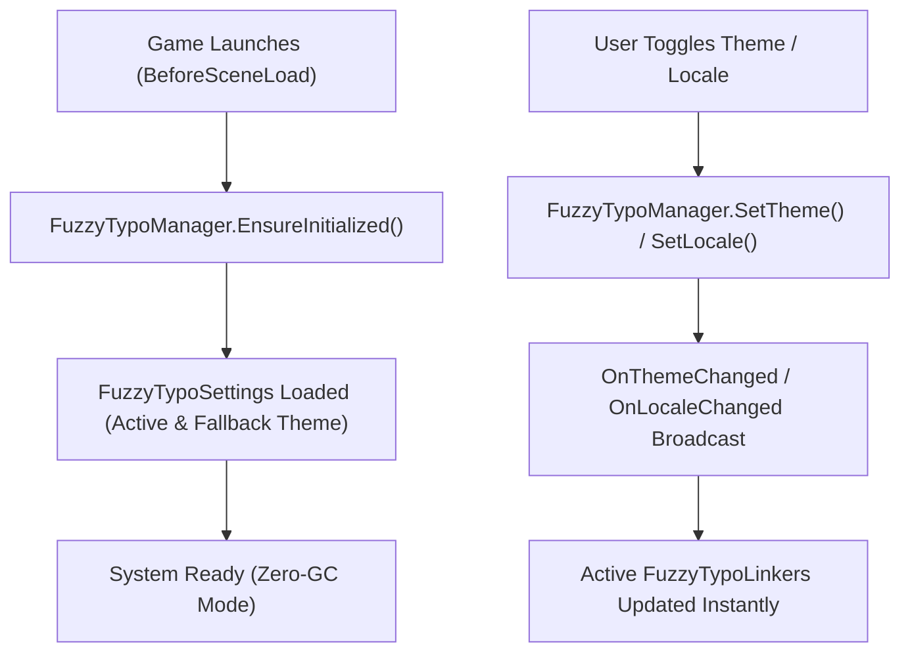

[← Previous: Standalone Editor Tools](/docs/fuzzytypo/standalone-tools/) | [Main Overview](/docs/fuzzytypo/) | [Next: FAQ & Troubleshooting →](/docs/fuzzytypo/faq-and-troubleshooting/)

---

## Runtime Architecture

The runtime backbone of FuzzyTypo is centered around the static **`FuzzyTypoManager`** class.

Upon application launch (during Unity's `BeforeSceneLoad` lifecycle phase), the manager automatically loads project settings (`AutoInitialize`), caches active theme data, and maintains state transitions across scene changes with zero garbage collection.



---

## `FuzzyTypoManager` API Reference

### Properties:
* `FuzzyTheme ActiveTheme`: The active theme driving typography at runtime. Assigning a new theme broadcasts the `OnThemeChanged` event.
* `FuzzyTheme FallbackTheme`: Recovery theme consulted if a style GUID is absent from the active theme.
* `string CurrentLocale`: Active ISO language code (e.g., `"en"`, `"tr"`, `"ja"`).
* `bool IsInitialized`: Indicates whether initialization has completed.

### Events:
```csharp
// Fired when the active theme is swapped (0 Byte GC Alloc)
public static event Action<FuzzyTheme> OnThemeChanged;

// Fired when the active culture/locale changes (0 Byte GC Alloc)
public static event Action<string> OnLocaleChanged;

// Fired when style parameters are updated in-place
public static event Action OnTypographyChanged;
```

### Methods:
* `FuzzyTextStyle GetStyle(string styleId)`: Retrieves a style by its GUID in **$O(1)$** lookup time.
* `void SetTheme(FuzzyTheme theme)`: Changes the active theme directly by object reference.
* `bool SetThemeByName(string themeName)`: Looks up and activates a theme from available settings by name.
* `void SetLocale(string localeCode)`: Changes active culture and notifies linked components.
* `void NotifyTypographyChanged()`: Broadcasts a general typography modification event.

---

## Practical Code Examples

### Example 1: In-Game Theme Toggling (Dark / Light Mode)
```csharp
using UnityEngine;
using UnityEngine.UI;
using FuzzyLogicLabs.FuzzyTypo;

public class UIThemeController : MonoBehaviour
{
    [SerializeField] private FuzzyTheme m_DarkTheme;
    [SerializeField] private FuzzyTheme m_LightTheme;

    public void ToggleTheme(bool isDark)
    {
        if (isDark)
        {
            FuzzyTypoManager.SetTheme(m_DarkTheme);
        }
        else
        {
            FuzzyTypoManager.SetTheme(m_LightTheme);
        }
    }

    public void ToggleThemeByName(string themeName)
    {
        // Searches registered themes and applies if found
        FuzzyTypoManager.SetThemeByName(themeName);
    }
}
```

### Example 2: Dynamic Text Spawning (Instantiate & Link)
When dynamically instantiating floating combat text or inventory cards during gameplay:

```csharp
using UnityEngine;
using TMPro;
using FuzzyLogicLabs.FuzzyTypo;

public class DamageTextSpawner : MonoBehaviour
{
    [SerializeField] private GameObject m_DamageTextPrefab;

    public void SpawnDamage(Vector3 position, int amount, bool isCritical)
    {
        GameObject textObj = Instantiate(m_DamageTextPrefab, position, Quaternion.identity);
        TMP_Text tmp = textObj.GetComponent<TMP_Text>();
        tmp.text = amount.ToString();

        // Connect design token dynamically
        FuzzyTypoLinker linker = textObj.GetComponent<FuzzyTypoLinker>();
        if (linker != null)
        {
            string targetStyleName = isCritical ? "Display / Critical Damage" : "Body / Damage";
            FuzzyTextStyle style = FuzzyTypoManager.ActiveTheme.GetStyleByName(targetStyleName);
            if (style != null)
            {
                linker.StyleId = style.Id; // Assigning ID automatically triggers ApplyStyle()
            }
        }
    }
}
```

### Example 3: Subscribing to Theme Change Events
```csharp
using UnityEngine;
using FuzzyLogicLabs.FuzzyTypo;

public class CustomUIElement : MonoBehaviour
{
    private void OnEnable()
    {
        FuzzyTypoManager.OnThemeChanged += HandleThemeChanged;
    }

    private void OnDisable()
    {
        FuzzyTypoManager.OnThemeChanged -= HandleThemeChanged;
    }

    private void HandleThemeChanged(FuzzyTheme newTheme)
    {
        Debug.Log($"Active theme changed to: {newTheme.ThemeName}");
        // Trigger custom UI animations or audio cues
    }
}
```

---

## Interactive Runtime Testing HUD (`FuzzyTypoRuntimeDemo`)

To facilitate runtime playtesting, FuzzyTypo includes the **`FuzzyTypoRuntimeDemo`** testing overlay:

### Features:
* **Draggable Window:** Reposition anywhere on screen via the window header.
* **Collapsible UI:** Minimizes to an unobtrusive icon to prevent view obstruction.
* **Instant Theme Swapping:** Fast buttons to toggle between 🌙 Dark and ☀ Light themes.
* **Multilingual Cycling:** Toggle among `EN`, `TR`, `JA (CJK)`, `DE`, and `AR` instantly to verify layout metrics and CJK glyph fallbacks.

---

[← Previous: Standalone Editor Tools](/docs/fuzzytypo/standalone-tools/) | [Main Overview](/docs/fuzzytypo/) | [Next: FAQ & Troubleshooting →](/docs/fuzzytypo/faq-and-troubleshooting/)
