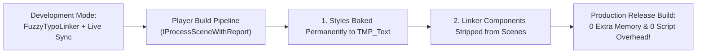

[← Previous: Master Dashboard: Insights & Analytics](/docs/fuzzytypo/insights-and-analytics/) | [Main Overview](/docs/fuzzytypo/) | [Next: Multilingual Typography & Localization →](/docs/fuzzytypo/localization-and-multilingual/)

---

## Tab 5: System Settings & Pro Engine

The final tab of the Master Dashboard, **Settings & Pro**, is where global configuration parameters are administered, industry-standard **JSON Design Tokens (Figma / W3C DTCG)** are exchanged, and release optimizations such as **Bake & Strip** are configured.


---

## 1. Build Optimization: Bake & Strip (Pro Engine)

In console, mobile, or AAA game architectures, unnecessary scripts and component overhead must be eliminated from final builds.

**The Bake & Strip Logic:**
* During development (Editor Mode), `FuzzyTypoLinker` components provide live synchronization and design agility.
* When compiling player release builds, final resolved typographic properties are written permanently into `TMP_Text` components (**Bake**), and all `FuzzyTypoLinker` instances are completely removed (**Strip**).
* **Result:** Zero additional memory overhead and zero script overhead on end-user runtime devices!



### Configuration Options:
* **Auto-Strip on Player Builds:** When enabled, the `FuzzyBakeAndStripProcessor` executes automatically during the Unity build pipeline.
* **Bake & Strip Active Scene Now:** Executes this process manually within the editor on the currently open scene (full `Ctrl+Z` undo supported).

---

## 2. Design Tokens Interoperability (Figma / W3C JSON)

Communicating with design teams working in Figma, Penpot, or web-based design systems is streamlined through the **W3C Design Tokens Community Group (DTCG)** format.

### Features:
* **Export JSON (`btn-export-tokens-json`):** Exports all styles, colors, font sizes, and metric margins from the active theme into a clean JSON structure.
* **Import JSON (`btn-import-tokens-json`):** Imports JSON files exported from Figma or Tokens Studio. Detects matching typefaces in your project and integrates tokens into the theme.

#### Sample Token JSON Format:
```json
{
  "themeName": "Dark Theme",
  "formatVersion": "1.0",
  "tokens": [
    {
      "id": "c7e48b9a-12d4-4f90-a3bc-91e847c2a110",
      "name": "H1 / Hero Display",
      "category": "Headings",
      "fontAssetName": "LiberationSans SDF",
      "fontSize": 38.0,
      "colorHex": "#FFFFFFFF",
      "fontStyle": "Bold",
      "alignment": "TopLeft",
      "characterSpacing": 0.0,
      "lineSpacing": 0.0
    }
  ]
}
```

---

## 3. Quick Setup & Starter Assets

* **Generate Starter Themes:** Generates fully configured `SampleDarkTheme` and `SampleLightTheme` assets in seconds.
* **Build Demo Scene:** Constructs an interactive showcase scene featuring 75+ realistic UI elements (combat HUDs, inventory panels, multilingual quest logs, and settings dialogues).
* **Project Settings:** Fast shortcut directly into Unity's `Edit > Project Settings > FuzzyTypo` pane.

---

## 4. Smart Localization Profiles

The lower section of the tab manages project-wide language scaling and font remapping rules:

* **+ Add Language Rule:** Adds a new locale rule (e.g., `ja` for Japanese or `ar` for Arabic).
* Configure default Fallback Fonts, Material Presets, Font Size Multipliers (`FontSizeMultiplier`), and Line Spacing Offsets (`LineSpacingOffset`) on a per-locale basis.
* For complete details on multilingual setups, proceed to the next chapter.

---

[← Previous: Master Dashboard: Insights & Analytics](/docs/fuzzytypo/insights-and-analytics/) | [Main Overview](/docs/fuzzytypo/) | [Next: Multilingual Typography & Localization →](/docs/fuzzytypo/localization-and-multilingual/)
