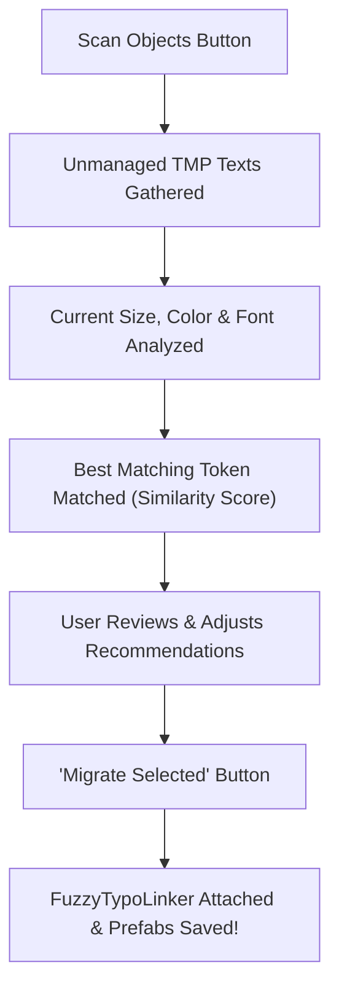

[← Previous: Multilingual Typography & Localization](/docs/fuzzytypo/localization-and-multilingual/) | [Main Overview](/docs/fuzzytypo/) | [Next: Runtime API & Scripting →](/docs/fuzzytypo/runtime-api-and-scripting/)

---

## Overview of Auxiliary Editor Utilities

Alongside the Master Dashboard, FuzzyTypo ships three standalone specialized tools designed to streamline common large-scale UI workflows:

| Tool Name | Class | Primary Purpose |
| :--- | :--- | :--- |
| **Auto-Migrator** | `FuzzyAutoMigrator` | Automatically migrates unmanaged TextMeshPro components from existing projects using similarity scoring. |
| **Glyph Analyzer** | `FuzzyGlyphAnalyzer` | Verifies font atlases against Turkish, German, French, or custom alphabets to catch missing glyphs before release. |
| **Batch Material Swapper** | `FuzzyMaterialSwapper` | Replaces material presets in bulk across scene and prefab hierarchies referencing specific fonts. |

---

## 1. FuzzyTypo Auto-Migrator (Legacy Project Migration Utility)

Onboarding existing projects with hundreds of unmanaged text GameObjects by hand can take days. **Auto-Migrator** accelerates this process into seconds.

### Capabilities:
* **Audit Scope:** `ActiveScene`, `SelectedHierarchy`, or all `ProjectPrefabs`.
* **Smart Similarity Scoring:** Analyzes text font sizes and colors, recommending the closest matching `FuzzyTextStyle` token (e.g., mapping a text of size `25.5` to `Heading 2` [26px]).
* **Batch Confirmation & Binding:** Use `Select All` and `Migrate Selected` to attach `FuzzyTypoLinker` components in a single click.

---

## 2. FuzzyTypo Glyph Analyzer (Font Character Set Verifier)

Before shipping your game in a new language, verify that your font assets actually contain all required glyphs.

### Built-In Character Presets:
* **Turkish:** `ç, ğ, ı, ö, ş, ü, Ç, Ğ, İ, Ö, Ş, Ü`
* **German:** `ä, ö, ü, ß, Ä, Ö, Ü`
* **French:** `à, â, æ, ç, é, è, ê, ë, î, ï, ô, œ, ù, û, ü, ÿ...`
* **Spanish:** `á, é, í, ó, ú, ü, ñ, ¿, ¡...`
* **Polish:** `ą, ć, ę, ł, ń, ó, ś, ź, ż...`
* **Japanese Hiragana:** `あ, い, う, え, お...`
* **Custom Text:** Paste localized dialogue or string tables to audit font coverage directly.

### Verification Features:
* **Fallback Chain Auditing:** Toggle `Include Fallback Fonts in Check` to evaluate glyph availability across assigned fallback chains.
* **Batch Theme Audit:** Analyzes all font assets referenced across the active theme in one operation.
* **Missing Glyph Breakdown:** Displays missing characters alongside their exact Unicode designations (e.g., `U+015E`).

---

## 3. Batch Material Swapper

Used when applying visual effects—such as gold specular outlines, neon glows, or holographic shaders—across all buttons or headings in a UI theme.

### How It Works:
1. **Filter Font Asset (Optional):** Target only text objects referencing a designated font.
2. **Filter Source Material (Optional):** Restrict swaps to objects currently using an older material preset.
3. **Target Material Preset:** Select the new TextMeshPro material preset to apply.
4. **Execute Swap:** Rebinds materials across all matching instances and updates prefab variants in one click.

---

[← Previous: Multilingual Typography & Localization](/docs/fuzzytypo/localization-and-multilingual/) | [Main Overview](/docs/fuzzytypo/) | [Next: Runtime API & Scripting →](/docs/fuzzytypo/runtime-api-and-scripting/)
